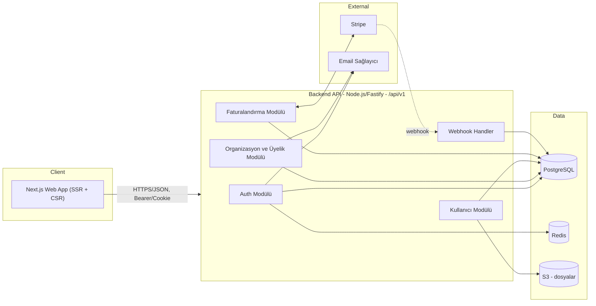
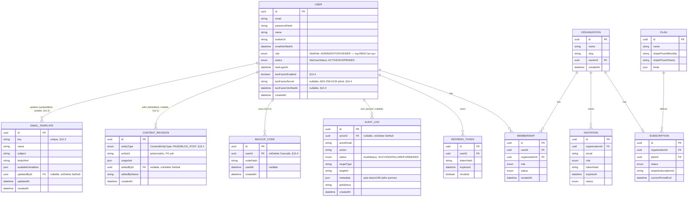

# Mimari Plan — SaaS / Kurumsal Uygulama

Durum: Taslak v1 · Sahibi: Mimar (Ekip Lideri) · Tüketiciler: `frontend-agent`, `backend-agent`

Bu doküman frontend ve backend ajanlarının bağımsız çalışıp birbiriyle uyumlu kod
üretebilmesi için sözleşme (contract) niteliğindedir. API şekli değişirse önce bu
dosya ve `openapi.yaml` / `shared-types.ts` güncellenir, sonra kod yazılır.

## 1. Kapsam ve varsayımlar

- Çok kiracılı (multi-tenant) bir SaaS: kullanıcılar bir veya birden fazla
  **Organizasyon**'a üye olur, her organizasyonun bir **Plan/Abonelik**i vardır.
- Standart özellik seti: kayıt/giriş, organizasyon yönetimi, üye davet/rol
  yönetimi, faturalandırma (Stripe), kullanıcı profili, dashboard.
- Somut bir ürün/domain (ör. proje yönetimi, CRM vb.) belirtilmediği için domain'e
  özel varlıklar (Project, Ticket, ...) bu plana **dahil edilmemiştir** — SaaS
  iskeletinin üstüne aynı desenle eklenmesi amaçlanmıştır.

## 2. Teknoloji yığını

| Katman | Seçim | Not |
|---|---|---|
| Frontend | Next.js 14+ (App Router), React, TypeScript, Tailwind CSS | `frontend-agent` standardı |
| Backend | Node.js + Fastify, TypeScript | `backend-agent` standardı (Node seçeneği) |
| ORM / DB | Prisma + PostgreSQL | İlişkisel, migration'lı şema |
| Cache / Oturum / Rate-limit | Redis | Refresh token deny-list, rate limit sayaçları |
| Doğrulama | Zod (ortak şema — hem FE form hem BE input validation aynı şemayı paylaşabilir) | |
| Auth | JWT (access, 15 dk, RS256) + rotasyonlu refresh token (httpOnly cookie, 30 gün) | |
| Ödeme | Stripe (Checkout + Billing Portal + Webhooks) | |
| Dosya depolama | S3 uyumlu object storage (avatar, vb.) | |
| E-posta | Resend/SES (doğrulama, davet, şifre sıfırlama) | |
| Dağıtım | Frontend: Vercel/Node edge; Backend: konteyner (Fly.io/Render/ECS) | |
| Gözlemlenebilirlik | OpenTelemetry + yapılandırılmış log (pino) | |

## 3. Sistem mimarisi



- Frontend backend'e **doğrudan DB erişimi olmadan**, yalnızca REST/JSON API
  üzerinden konuşur. Next.js Server Components/Route Handlers backend'e sunucu
  tarafında proxy yapabilir (secret tutmak için), ama iş mantığı backend'dedir.
- Backend stateless'tir; oturum durumu Redis'te (refresh token rotasyonu, rate
  limit) tutulur, yatay ölçeklenebilir.

## 4. Çok kiracılılık (multi-tenancy) modeli

- **Paylaşımlı veritabanı + `organization_id` sütunu** (row-level tenancy).
  Erken/orta ölçek SaaS için en düşük operasyonel maliyetli model; ileride
  büyük müşteriler için şema-başına-kiracıya geçiş kapıyı kapatmaz.
- Her istekte aktif organizasyon `X-Org-Id` header'ı (veya JWT içine gömülü
  `org_id` claim'i, kullanıcı org değiştirdiğinde token yenilenir) ile belirlenir.
- Backend'de her repository/sorgu katmanında zorunlu `organization_id` filtresi
  — tenant izolasyonu ORM seviyesinde (Prisma middleware) merkezi olarak uygulanır,
  her endpoint'te elle tekrarlanmaz.

## 5. Kimlik doğrulama ve yetkilendirme

- **Kayıt/giriş**: e-posta + şifre (argon2id hash). OAuth (Google) v2 kapsamında.
- **Access token**: JWT, RS256, 15 dk ömür, gövdede `sub` (userId), `org_id`,
  `role` claim'leri.
- **Refresh token**: opak, rastgele 256-bit, httpOnly + Secure + SameSite=Strict
  cookie, 30 gün, DB/Redis'te hash'lenerek saklanır, her refresh'te rotate edilir
  (tekrar kullanım tespiti = tüm oturumları iptal et).
- **CSRF**: cookie tabanlı refresh akışı için double-submit token veya
  `SameSite=Strict` + özel header kontrolü.
- **Yetkilendirme (RBAC)**: organizasyon bazlı roller — `OWNER`, `ADMIN`,
  `MEMBER`. Rol kontrolü backend'de merkezi bir guard/middleware ile yapılır;
  frontend yalnızca UI'ı role göre gizler/gösterir, gerçek yetki kontrolü asla
  istemciye güvenmez (bkz. mutfak konfigüratör projesindeki fiyat motoru
  deseni — istemci değeri her zaman sunucuda yeniden doğrulanır).
- **Site-geneli RBAC (`/admin/*` CMS uçları)**: yukarıdaki organizasyon bazlı
  RBAC'tan tamamen AYRI bir eksen — `pages`/`blog`/`media`/`settings`/`navigation`/
  `users`/`logs` gibi tek-site CMS uçlarında `User.role` (`SiteRole`:
  `ADMIN`/`EDITOR`/`VIEWER`) ve `User.status` (`SiteUserStatus`:
  `ACTIVE`/`SUSPENDED`) kullanılır. Rol/durum kasıtlı olarak JWT'ye GÖMÜLMEZ — her
  istekte `authenticate` middleware'i DB'den taze okur, böylece bir rol değişikliği
  veya askıya alma bir sonraki istekte hemen etkili olur (access token süresinin
  dolmasını beklemeden). Guard: `requireSiteRole` (bkz. `middleware/site-rbac.ts`).
  Yazma uçlarındaki (`POST`/`PATCH`/`PUT`/`DELETE`) rol eşiği: `pages`/`blog`
  oluşturma-düzenleme → `ADMIN`+`EDITOR`, silme → yalnızca `ADMIN`; `media`
  yükleme → `ADMIN`+`EDITOR`, silme → yalnızca `ADMIN`; `settings` güncelleme →
  yalnızca `ADMIN`; `navigation` (header/footer/nav yapılandırması) güncelleme →
  yalnızca `ADMIN`; `users`/`logs` → tüm uçlar yalnızca `ADMIN`.
  Sistemde en az bir aktif `ADMIN` kalması zorunlu tutulur (son admin'i düşürmek/
  askıya almak 409 CONFLICT döner); bir kullanıcı kendi hesabını askıya alamaz.
- **Audit Log**: hassas/yetkilendirme aksiyonları (`auth.login` başarı/başarısızlık,
  `user.create`/`user.role_change`/`user.status_change`, `settings.update`, ve
  `requireSiteRole` guard'ının engellediği her istek — `FORBIDDEN` durumuyla
  otomatik) değişmez şekilde `AuditLog` tablosuna yazılır (bkz. `lib/audit.ts`).
  `metadata` alanına asla token/URL/şifre yazılmaz. Sadece `ADMIN` rolü
  `GET /admin/logs` ile okuyabilir (en yeni kayıt önce, `status`/`action` öneki
  ile filtrelenebilir).

## 6. Veri modeli (özet ER)



## 7. API tasarım ilkeleri

- **Base path**: `/api/v1` — büyük kırıcı değişiklikler `v2` ile yapılır.
- **Zarf (envelope)**: başarı `{ "data": ... , "meta"?: ... }`; hata
  `{ "error": { "code": string, "message": string, "details"?: object } }`.
  HTTP status kodu her zaman doğru anlamı taşır (200/201/204/400/401/403/404/409/422/429/500).
- **Sayfalama**: cursor tabanlı — `?limit=20&cursor=<opaque>` →
  `meta: { nextCursor: string | null }`.
- **Kimlik doğrulama**: `Authorization: Bearer <accessToken>` (API istemcileri) veya
  httpOnly cookie (web app SSR). Public uçlar hariç tüm uçlarda zorunlu.
- **Doğrulama**: tüm request body/query Zod şemasıyla doğrulanır; başarısızsa `422`
  ve `details` içinde alan bazlı hatalar.
- **Idempotency**: ödeme/checkout gibi durum değiştiren kritik POST'larda
  `Idempotency-Key` header desteği.
- **Rate limiting**: kullanıcı/IP başına Redis token-bucket; aşımda `429` +
  `Retry-After`.
- Tam uç nokta sözleşmesi: **[`openapi.yaml`](./openapi.yaml)** (OpenAPI 3.0).
- Paylaşılan TypeScript arayüzleri (FE ve BE aynı tipleri kullanır):
  **[`shared-types.ts`](./shared-types.ts)**.

## 8. Uç nokta özeti

| Grup | Uç nokta | Yetki |
|---|---|---|
| Auth | `POST /auth/register` | public |
| Auth | `POST /auth/login` | public |
| Auth | `POST /auth/refresh` | refresh cookie |
| Auth | `POST /auth/logout` | authenticated |
| Auth | `POST /auth/forgot-password` / `POST /auth/reset-password` | public |
| Auth | `GET /auth/me` | authenticated |
| Users | `GET/PATCH /users/me` | authenticated |
| Orgs | `POST/GET /organizations`, `GET/PATCH/DELETE /organizations/{id}` | authenticated, rol bazlı |
| Members | `GET /organizations/{id}/members`, `PATCH/DELETE /organizations/{id}/members/{userId}` | ADMIN/OWNER |
| Invitations | `POST/GET /organizations/{id}/invitations`, `POST /invitations/{token}/accept` | ADMIN/OWNER (davet gönderme); token sahibi (kabul) |
| Plans | `GET /plans` | public |
| Billing | `GET /organizations/{id}/subscription`, `POST .../checkout-session`, `POST .../portal-session` | OWNER |
| Webhooks | `POST /webhooks/stripe` | Stripe imza doğrulaması |
| Health | `GET /healthz` | public |
| AdminUsers | `GET/POST /admin/users`, `PATCH /admin/users/{id}/role`, `PATCH /admin/users/{id}/status` | site-geneli `SiteRole=ADMIN` |
| AdminUsers | `GET /admin/settings/permissions` | site-geneli `SiteRole=ADMIN` |
| Logs | `GET /admin/logs` | site-geneli `SiteRole=ADMIN` |
| Navigation | `GET /navigation` | public |
| Navigation | `GET /admin/navigation` | authenticated |
| Navigation | `PUT /admin/navigation` | site-geneli `SiteRole=ADMIN` |
| Stats | `GET /admin/stats/views` | authenticated |
| Stats | `GET /admin/stats/live-visitors` | authenticated |
| Stats | `GET /admin/stats/breakdown` | authenticated |
| System | `GET /admin/health` | site-geneli `SiteRole=ADMIN` |

> Not: `pages`/`blog`/`media`/`settings` CMS uçları (`/admin/pages`, `/admin/blog`,
> `/admin/media`, `/admin/settings`) bu tablonun ilk sürümünden sonra eklendi;
> tam sözleşmeleri için `openapi.yaml`'a bakın. Bu uçlardaki yazma işlemleri artık
> yukarıdaki site-geneli `SiteRole` guard'ına da tabidir (bkz. §5).

> Navigasyon/Header/Footer Yönetimi: `GET /navigation` (public — site
> header/nav/footer bunu okur), `GET /admin/navigation` (authenticated),
> `PUT /admin/navigation` (yalnızca `SiteRole=ADMIN`, tam değiştirme/replace
> semantiği — `navigationItems`/`socialLinks`/`footerColumns` dizileri tek bir
> transaction içinde delete-then-recreate edilir). Modeller: `NavigationItem`,
> `SocialLink` (`SocialPlatform` enum), `FooterColumn` → `FooterLink` (1-n,
> `onDelete: Cascade`); ayrıca `SiteSettings`'e `headerCtaLabel`/`headerCtaHref`/
> `footerCopyrightText` eklendi. Tam sözleşme için `openapi.yaml`'daki
> `NavigationConfig`/`UpdateNavigationConfigRequest` şemalarına bakın.

> Canlı Analytics (cihaz/ülke kırılımı + canlı ziyaretçi sayısı): `PageView`
> modeline `deviceType` (`DeviceType`: `MOBILE`/`DESKTOP`/`TABLET`/`UNKNOWN`,
> User-Agent'tan `lib/device.ts::detectDeviceType` ile) ve `country` (ISO 3166-1
> alpha-2, bilinmiyorsa `"UNKNOWN"` sentinel — NULL değil, aksi halde Postgres
> unique index'lerinde NULL'ların birbirinden farklı sayılması upsert'te çifte
> satır/race condition riski yaratır; IP'den `geoip-lite` ile — offline, harici
> API çağrısı/anahtar YOK — `lib/geo.ts::detectCountry` ile) eklendi. Bu ikisi ve
> `date` birlikte compound unique kısıtını oluşturur (`(pageId|postId, date,
> deviceType, country)`), böylece "aynı gün + aynı cihaz + aynı ülke" için
> upsert count'u artırır. `GET /admin/stats/breakdown?days=N` bu kırılımı
> `groupBy` ile özetler (ülkelerde ilk 10 + kalanı `"OTHER"` olarak toplanır).
> `GET /admin/stats/live-visitors` süreç-içi (in-memory, `lib/live-visitors.ts`)
> "son 60 saniyede view endpoint'i çağıran IP+User-Agent" sayacını döner — DAĞITIK
> DEĞİL (çoklu instance'ta her process kendi sayacını tutar, Redis gibi paylaşımlı
> bir store bu kapsamda yok), sunucu yeniden başlarsa sıfırlanır; gerçek istek
> sinyaline dayanır, uydurma/simüle veri ÜRETİLMEZ. Sistem sağlığı (`GET
> /admin/health`, yalnızca `SiteRole=ADMIN`): gerçek zamanlı DB ping (`SELECT 1`
> süresi), `pg_database_size` ile DB boyutu, `Media.sizeBytes` toplamı, Node
> `os`/`process` modüllerinden bellek/yük/uptime — hiçbir alan sabit/uydurma
> değildir. `DB_STORAGE_QUOTA_MB`/`MEDIA_STORAGE_QUOTA_MB` ortam değişkenleri
> tanımlıysa quota alanları doldurulur (frontend doluluk yüzdesi hesaplayabilir),
> tanımsızsa `null` döner (frontend yalnızca mutlak boyutu gösterir — asla
> varsayılan/sahte bir kota göstermez).

Ayrıntılı request/response şemaları için `openapi.yaml` esastır.

## 9. Frontend ↔ Backend entegrasyon kuralları (Mimar sorumluluğu)

1. **Kontrat önce yazılır**: `openapi.yaml` ve `shared-types.ts` bu dosyayla
   birlikte güncellenmeden hiçbir taraf endpoint şekli değiştirmez.
2. **Tip üretimi**: backend Zod şemalarından, frontend bunlardan türetilen
   TypeScript tiplerini kullanır (`shared-types.ts` tek doğruluk kaynağıdır);
   iki taraf da elle ikinci bir tip tanımı yazmaz.
3. **Hata sözleşmesi**: frontend her zaman `error.code` üzerinden dallanır
   (i18n mesajı FE'de tutulur), `error.message`'a UI mantığı bağlamaz.
4. **Sunucu asıl kaynak**: fiyat/limit/yetki gibi değerler her zaman backend'de
   yeniden hesaplanır/doğrulanır; frontend yalnızca gösterim/iyimser UI yapar.
5. **Çakışma çözümü**: FE ve BE farklı alan adı/şekli üretirse, bu doküman ve
   `shared-types.ts` bağlayıcıdır; farklılık tespit edilirse önce burada
   düzeltme yapılır, sonra ilgili ajan koduna yansıtılır.

## 10. "Olmazsa Olmaz" Modülleri v1 (Taslak — bağlayıcı sözleşme)

Durum: Taslak v1 · Sahibi: Mimar. Bu bölüm §5-§8'deki mevcut kurallara (site-geneli
`SiteRole` RBAC, `AuditLog`, zarf/hata sözleşmesi, cursor sayfalama) tabidir; burada
yalnızca 5 yeni modülün veri modeli ve uç noktaları tanımlanır. `db-agent`,
`backend-agent`, `security-agent`, `frontend-agent` bu bölümü tek doğruluk kaynağı
olarak kullanır — şekil değişirse önce burada güncellenir.

### 10.1 İçerik Sürüm Kontrolü (Revision History)

**Model** `ContentRevision`:
```
id            uuid PK
seq           int unique autoincrement
entityType    enum ContentEntityType { PAGE, BLOG_POST }
entityId      string            // Page.id veya BlogPost.id (FK yok — silinen içerikle
                                  // birlikte revizyonların da silinmesi Cascade ile
                                  // sağlanır: entityId'ye göre elle temizlik gerekmez,
                                  // bkz. not aşağıda)
snapshot      Json              // güncellemeden HEMEN ÖNCEKİ tam alan seti
editedById    string? FK->User  onDelete: SetNull
editedByName  string            // silinen kullanıcı için okunabilir ad snapshot'ı
createdAt     datetime @default(now())

@@index([entityType, entityId, createdAt])
```
- Not: `entityId` polymorphic olduğu için gerçek bir FK/Cascade kurulamaz; Page/BlogPost
  silindiğinde ilişkili `ContentRevision` kayıtlarını service katmanında (aynı
  transaction içinde) elle silin.
- `snapshot` şekli: Page için `{ title, slug, blocks, seoTitle, seoDescription, ogTitle,
  ogImageUrl, canonicalUrl, noIndex, translations }`; BlogPost için `{ title, slug,
  excerpt, contentHtml, coverImageUrl, categoryId, seoTitle, seoDescription, ogTitle,
  ogImageUrl, canonicalUrl, noIndex, translations }`.
- **Yazma kuralı**: `PATCH /admin/pages/{id}` ve `PATCH /admin/blog/{id}` her
  güncellemeden önce mevcut (eski) satırın `snapshot`'ını `ContentRevision`'a yazar
  (aynı transaction). Entity başına en fazla **50** revizyon tutulur — 51. yazımda en
  eski kayıt silinir (`findMany` + `orderBy createdAt asc` + `take` fazlasını sil).
- **Uç noktalar** (yetki: ilgili entity'nin yazma eşiğiyle aynı — `ADMIN`+`EDITOR`):
  - `GET /admin/pages/{id}/revisions?limit&cursor` → `data: ContentRevision[]`
    (snapshot alanı hariç liste görünümü: id, editedByName, createdAt, seq — detay için
    ayrı çağrı), `GET /admin/pages/{id}/revisions/{revisionId}` → tam snapshot dahil.
  - `POST /admin/pages/{id}/revisions/{revisionId}/restore` → önce mevcut state'i yeni
    bir revizyon olarak kaydeder (geri dönüş de geri alınabilir olsun diye), sonra
    snapshot'ı uygular, güncel `Page` DTO'sunu döner.
  - Aynı üçlü `blog` için: `GET/POST /admin/blog/{id}/revisions[...]`.

### 10.2 Gelişmiş SEO & Social Card (Meta Management)

Yeni backend/DB işi minimal — mevcut `Page`/`BlogPost` alanlarına ekleme:
```
ogTitle        String?
ogImageUrl     String?
canonicalUrl   String?
noIndex        Boolean  @default(false)
```
(`seoTitle`/`seoDescription` `Page`'de zaten vardı; `BlogPost`'ta YOKTU — db-agent bunu da
aynı migration'a ekledi, bkz. §6 ER diyagramı.) Bu alanlar mevcut
`UpdatePageRequestSchema` / `UpdateBlogPostRequestSchema`'ya (Zod, tümü `.optional()`,
`canonicalUrl` boşsa `null`, geçerliyse `z.string().url()`) ve DTO'lara eklenir; **yeni
endpoint yok**. Public `GET /pages/{slug}` ve `GET /blog/{slug}` cevaplarına da bu
alanlar eklenir (frontend `<head>` meta/canonical/robots etiketlerini bunlardan üretir;
`noIndex=true` → `<meta name="robots" content="noindex">`).
Google SERP / Twitter / LinkedIn kart önizlemesi **saf frontend bileşeni** — form
state'inden türetilir, backend'e ihtiyaç duymaz.

### 10.3 E-posta & Bildirim Şablonu Yöneticisi

**Model** `EmailTemplate`:
```
id                  uuid PK
key                 string @unique   // "WELCOME" | "PASSWORD_RESET" | "SYSTEM_ANNOUNCEMENT"
name                string           // insan-okur ad, ör. "Hoş Geldin E-postası"
subject             string
bodyHtml            string
availableVariables  Json             // ör. ["user_name","reset_link"] — salt bilgi amaçlı
updatedById         string? FK->User onDelete: SetNull
updatedAt           datetime @updatedAt
createdAt           datetime @default(now())
```
- `prisma/seed.ts` üç varsayılan kaydı (`WELCOME`, `PASSWORD_RESET`,
  `SYSTEM_ANNOUNCEMENT`) `availableVariables` ile birlikte tohumlar.
- Değişken sözdizimi: `{{user_name}}`, `{{reset_link}}` vb. — render'da basit,
  allow-list'e dayalı string replace kullanılır (bir template engine/`eval` KULLANILMAZ
  — enjeksiyon riski).
- **Uç noktalar** (yetki: `ADMIN` — bu iletiler tüm kullanıcılara gidebildiği için
  `EDITOR` eşiği yetersiz):
  - `GET /admin/notifications/templates` → `data: EmailTemplate[]`
  - `GET /admin/notifications/templates/{key}` → `data: EmailTemplate`
  - `PATCH /admin/notifications/templates/{key}` body `{ subject?, bodyHtml? }` →
    audit log (`notifications.template_update`)
  - `POST /admin/notifications/templates/{key}/preview` body
    `{ sampleValues: Record<string,string> }` → `data: { renderedSubject, renderedHtml }`
- Gerçek e-posta gönderimi kapsam dışı (mevcut `TODO(email-provider)` — bkz.
  `auth.service.ts::forgotPassword` — geçerliliğini korur); bu modül yalnızca şablon
  CRUD + önizleme sağlar.

### 10.4 Güvenlik & 2FA (TOTP) + Aktif Oturumlar

**`User` model eklemeleri**:
```
twoFactorEnabled     Boolean   @default(false)
twoFactorSecret      String?   // AES-256-GCM ile şifrelenmiş base32 TOTP secret — DÜZ METİN SAKLANMAZ
twoFactorVerifiedAt  DateTime?
```
Şifreleme: yeni `lib/crypto.ts` (`encryptSecret`/`decryptSecret`, AES-256-GCM), anahtar
`env.ENCRYPTION_KEY` (32 byte, base64 — `.env.example`'a eklenir).

**Yeni model** `BackupCode`:
```
id        uuid PK
userId    string FK->User onDelete: Cascade
codeHash  string   // sha256(code) — argon2 gerekmez, tek kullanımlık kısa kod
usedAt    DateTime?
createdAt DateTime @default(now())

@@index([userId])
```
Etkinleştirmede 10 adet insan-okur kod (ör. `XXXX-XXXX`) üretilir, hash'lenip saklanır,
**düz metin yalnızca bir kez** response'ta döner.

**Login akışı değişikliği** (`auth.service.ts::login`): şifre doğrulandıktan sonra
`user.twoFactorEnabled === true` ise token çifti HEMEN verilmez; bunun yerine 5 dakika
ömürlü, `purpose: "2fa_challenge"` claim'li bir JWT (`challengeToken`) üretilip
`{ requiresTwoFactor: true, challengeToken }` (200) döner. Yeni:
`POST /auth/2fa/verify` body `{ challengeToken, code }` → `code` TOTP veya bir backup
kodu ile eşleşirse (backup kodu kullanılırsa `usedAt` işaretlenir, tek kullanımlık)
normal `login` ile aynı token çiftini üretir ve döner.

**Uç noktalar** (`/admin/settings/security/2fa/*`, hepsi `authenticate` gerektirir —
org/site-rol şartı yok, herkes KENDİ hesabı için yönetir):
- `POST .../setup` → yeni secret üretir (henüz DB'ye YAZILMAZ, JWT'ye gömülü kısa ömürlü
  `setupToken` içinde taşınır), `data: { otpauthUrl, qrCodeDataUrl, setupToken }`.
- `POST .../enable` body `{ setupToken, code }` → doğrularsa `twoFactorSecret`
  (şifreli) + `twoFactorEnabled=true` yazar, 10 backup kodu üretir, `data: { backupCodes: string[] }`
  döner (audit: `security.2fa_enable`).
- `POST .../disable` body `{ password }` → şifre doğrulaması ister, 2FA'yı kapatır,
  `BackupCode` kayıtlarını siler, **mevcut oturum hariç** tüm `RefreshToken`'ları iptal
  eder (audit: `security.2fa_disable`).
- `POST .../backup-codes/regenerate` body `{ password }` → eskileri geçersiz kılar, 10
  yeni kod döner (audit: `security.2fa_backup_codes_regenerate`).

**Aktif oturumlar** (`/admin/settings/security/sessions`, yeni tablo GEREKMEZ —
`RefreshToken.userAgent`/`ipAddress` zaten var):
- `GET .../sessions` → `data: Session[]` (`id, userAgent, ipAddress, createdAt,
  expiresAt, isCurrent`) — yalnızca `revoked=false && expiresAt > now()`.
- `DELETE .../sessions/{id}` → o oturumu iptal eder (audit: `security.session_revoke`).
- `POST .../sessions/revoke-others` → mevcut hariç tümünü iptal eder.
- "Mevcut oturum" tespiti: istek cookie'sindeki ham refresh token hash'i ile eşleşen
  kayıt `isCurrent: true`.

Yeni bağımlılıklar (backend): `otplib` (TOTP), `qrcode` (PNG data URI üretimi).

### 10.5 Çoklu Dil & Yerelleştirme (i18n)

**İçerik çevirisi** — yeni tablo yerine mevcut JSON-alan deseniyle tutarlı, tek ek
alan: `Page` ve `BlogPost`'a `translations Json @default("{}")`. Şekil:
```ts
type Translations = {
  EN?: {
    title?: string; seoTitle?: string; seoDescription?: string; ogTitle?: string;
    canonicalUrl?: string;
    blocks?: unknown[];       // yalnızca Page
    excerpt?: string; contentHtml?: string;  // yalnızca BlogPost
  };
};
```
TR = kanonik/varsayılan (mevcut kolonlar), `translations.EN` yalnızca override'ları
taşır (kısmi olabilir — eksik alan TR'ye düşer). `PATCH` endpoint'leri body'de
`translations?: Translations` alanını **shallow merge** ile kabul eder (tam replace
DEĞİL — `EN` objesi kendi içinde tam replace, ama TR kolonlarını etkilemez).
Public okuma: `GET /pages/{slug}?locale=EN` / `GET /blog/{slug}?locale=EN` — alan
bazlı fallback (EN'de olmayan alan TR'den gelir); `locale` verilmezse/`TR` ise
kolonlar direkt döner.

**Admin panel arayüz dili** (chrome/UI metinleri, içerikten bağımsız) — backend işi
YOK, saf frontend: `localStorage` (`adminLocale`, `"tr"|"en"`) + basit
`I18nProvider`/`useT()` context'i (iki küçük sözlük dosyası). Yeni bağımlılık (ör.
`next-intl`) eklenmez — kapsam admin chrome'u ile sınırlı, routing gerektirmez.
`AdminTopbar`'a dil seçici (bayrak/kısaltma) eklenir.

### 10.6 Hesap Ayarları ("Hesabım") + Global Bildirim (Toast) Standardı

**Şema değişikliği GEREKMEZ.** `User.name` ve `User.avatarUrl` zaten mevcut;
`AuditLog.action` serbest `String` (enum değil), yeni action ismi için migration
gerekmez. db-agent bu iş için devreye GİRMEZ.

**Uç noktalar** (`/users/*`, `authenticate` yeterli — herkes yalnızca KENDİ hesabını
yönetir, site-rol şartı YOK):
- `PATCH /users/me` (MEVCUT) → `{ name?, avatarUrl? }`. **Sözleşme düzeltmesi:**
  `avatarUrl` artık `string | null`; `null` avatarı kaldırır. Boş string `""`
  GEÇERSİZDİR (422) — istemci `""` yerine `null` göndermelidir.
- `POST /users/me/change-password` (YENİ) → body `{ currentPassword, newPassword }`,
  başarıda **204** (gövde yok).
  - `currentPassword` argon2 (`lib/password.ts::verifyPassword`) ile doğrulanır;
    hatalıysa `401 UNAUTHORIZED` ("Şifre hatalı.") + audit `status: FAILURE`.
  - `newPassword`: min 8 karakter (`RegisterRequest.password` ile aynı kural);
    `newPassword === currentPassword` ise `422` (`details.newPassword`).
  - Başarıda `passwordHash` güncellenir ve **mevcut oturum HARİÇ** tüm
    `RefreshToken` kayıtları `revoked=true` yapılır — `2fa/disable` ile birebir aynı
    politika (cookie'deki ham token'ın `hashToken()` karşılığı hariç tutulur).
    Gerekçe: şifre değişiminde diğer cihazlardaki oturumlar zorla kapanmalıdır;
    isteği yapan cihazın oturumu bilinçli olarak korunur (kullanıcı kendini atmaz).
  - Audit action: `security.password_change` (`targetType: "User"`, `targetId: <kendi
    id>`; `metadata` ASLA şifre/hash içermez).
  - Rate limit: route-level `config.rateLimit = { max: 5, timeWindow: "1 minute" }` —
    `security.routes.ts::SENSITIVE_ACTION_RATE_LIMIT` ile aynı desen. Aşılırsa
    `429 RATE_LIMITED`.

**Frontend yerleşimi**: `/admin/account` ROUTE'u (modal DEĞİL). Gerekçe: üç ayrı
bölüm (profil / avatar / şifre) + `MediaPicker` gibi kendi başına modal açan bir alt
bileşen içerir; modal-içinde-modal deseninden kaçınılır ve `/admin/settings/security`
ile aynı "kişisel hesap" bilgi mimarisi korunur. Şifre değiştirme formu bu sayfa
İÇİNDE bir `Card`'dır (2FA disable'daki gibi ayrı bir `Dialog` değil) — sayfanın
kendisi zaten kimliği doğrulanmış özel bir alandır.

**Toast standardı** (`sonner`, `providers.tsx`'te mount edilmiş — yeni altyapı YOK):
kullanıcı tarafından TETİKLENEN her mutasyon (create/update/delete/restore/bulk)
sonucunda tam olarak bir toast gösterilir.
- Başarı: `toast.success("<Varlık> <fiil geçmiş zaman>.")` — ör. "Yazı oluşturuldu."
- Hata: `toast.error(friendlyErrorMessage(err))`.
- Toast, mevcut inline `Alert`/`saveError` gösterimini KALDIRMAZ; kalıcı bağlam için
  inline hata korunur, toast anlık geri bildirimdir (mevcut `settings/page.tsx`
  deseni referanstır).
- İSTİSNA: kullanıcı tetiklemeyen arka plan yüklemeleri (`load()`, liste/polling
  hataları) toast ÜRETMEZ — bunlar inline `Alert` ile gösterilir.
