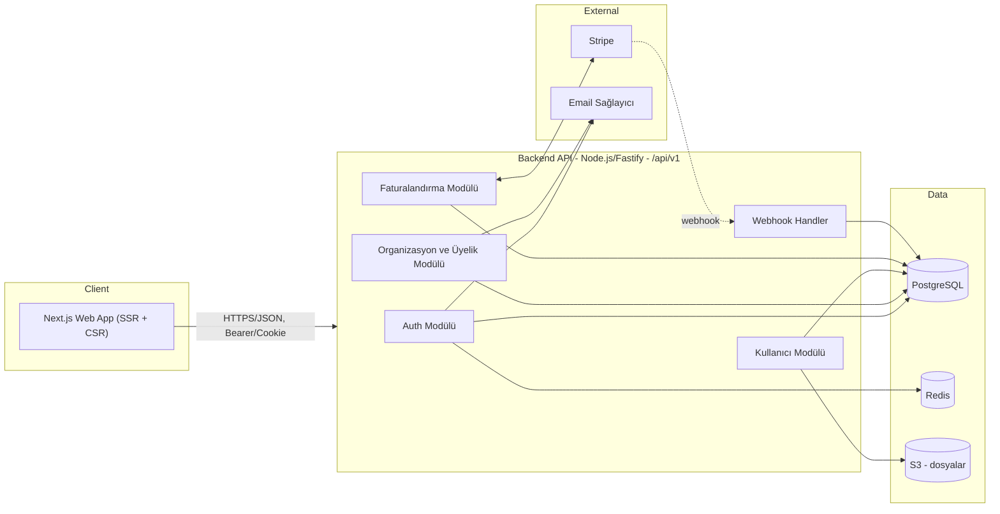
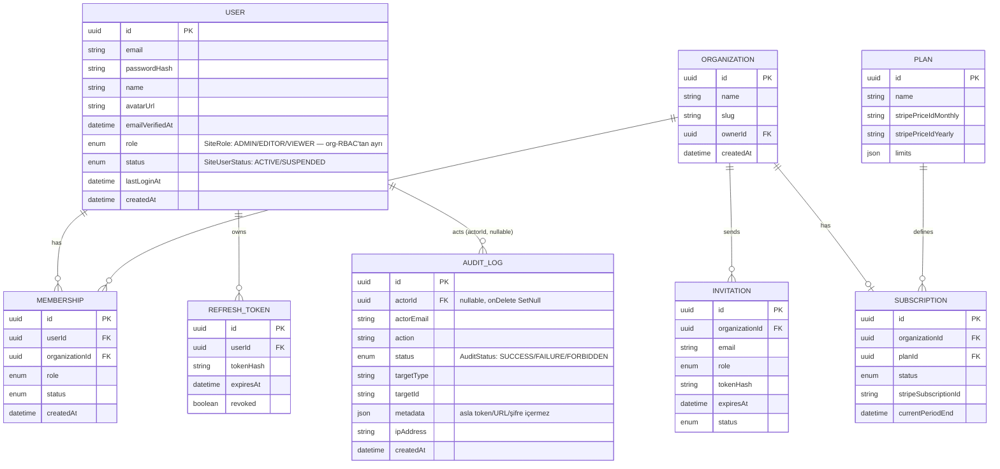

# Mimari Plan — SaaS / Kurumsal Uygulama

Durum: Taslak v1 · Sahibi: Mimar (Ekip Lideri) · Tüketiciler: `frontend-agent`, `backend-agent`

Bu doküman frontend ve backend ajanlarının bağımsız çalışıp birbiriyle uyumlu kod
üretebilmesi için sözleşme (contract) niteliğindedir. API şekli değişirse önce bu
dosya ve `openapi.yaml` / `shared-types.ts` güncellenir, sonra kod yazılır.

## 1. Kapsam ve varsayımlar

- Çok kiracılı (multi-tenant) bir SaaS: kullanıcılar bir veya birden fazla
  **Organizasyon**'a üye olur, her organizasyonun bir **Plan/Abonelik**i vardır.
- Standart özellik seti: kayıt/giriş, organizasyon yönetimi, üye davet/rol
  yönetimi, faturalandırma (Stripe), kullanıcı profili, dashboard.
- Somut bir ürün/domain (ör. proje yönetimi, CRM vb.) belirtilmediği için domain'e
  özel varlıklar (Project, Ticket, ...) bu plana **dahil edilmemiştir** — SaaS
  iskeletinin üstüne aynı desenle eklenmesi amaçlanmıştır.

## 2. Teknoloji yığını

| Katman | Seçim | Not |
|---|---|---|
| Frontend | Next.js 14+ (App Router), React, TypeScript, Tailwind CSS | `frontend-agent` standardı |
| Backend | Node.js + Fastify, TypeScript | `backend-agent` standardı (Node seçeneği) |
| ORM / DB | Prisma + PostgreSQL | İlişkisel, migration'lı şema |
| Cache / Oturum / Rate-limit | Redis | Refresh token deny-list, rate limit sayaçları |
| Doğrulama | Zod (ortak şema — hem FE form hem BE input validation aynı şemayı paylaşabilir) | |
| Auth | JWT (access, 15 dk, RS256) + rotasyonlu refresh token (httpOnly cookie, 30 gün) | |
| Ödeme | Stripe (Checkout + Billing Portal + Webhooks) | |
| Dosya depolama | S3 uyumlu object storage (avatar, vb.) | |
| E-posta | Resend/SES (doğrulama, davet, şifre sıfırlama) | |
| Dağıtım | Frontend: Vercel/Node edge; Backend: konteyner (Fly.io/Render/ECS) | |
| Gözlemlenebilirlik | OpenTelemetry + yapılandırılmış log (pino) | |

## 3. Sistem mimarisi

- Frontend backend'e **doğrudan DB erişimi olmadan**, yalnızca REST/JSON API
  üzerinden konuşur. Next.js Server Components/Route Handlers backend'e sunucu
  tarafında proxy yapabilir (secret tutmak için), ama iş mantığı backend'dedir.
- Backend stateless'tir; oturum durumu Redis'te (refresh token rotasyonu, rate
  limit) tutulur, yatay ölçeklenebilir.

## 4. Çok kiracılılık (multi-tenancy) modeli

- **Paylaşımlı veritabanı + `organization_id` sütunu** (row-level tenancy).
  Erken/orta ölçek SaaS için en düşük operasyonel maliyetli model; ileride
  büyük müşteriler için şema-başına-kiracıya geçiş kapıyı kapatmaz.
- Her istekte aktif organizasyon `X-Org-Id` header'ı (veya JWT içine gömülü
  `org_id` claim'i, kullanıcı org değiştirdiğinde token yenilenir) ile belirlenir.
- Backend'de her repository/sorgu katmanında zorunlu `organization_id` filtresi
  — tenant izolasyonu ORM seviyesinde (Prisma middleware) merkezi olarak uygulanır,
  her endpoint'te elle tekrarlanmaz.

## 5. Kimlik doğrulama ve yetkilendirme

- **Kayıt/giriş**: e-posta + şifre (argon2id hash). OAuth (Google) v2 kapsamında.
- **Access token**: JWT, RS256, 15 dk ömür, gövdede `sub` (userId), `org_id`,
  `role` claim'leri.
- **Refresh token**: opak, rastgele 256-bit, httpOnly + Secure + SameSite=Strict
  cookie, 30 gün, DB/Redis'te hash'lenerek saklanır, her refresh'te rotate edilir
  (tekrar kullanım tespiti = tüm oturumları iptal et).
- **CSRF**: cookie tabanlı refresh akışı için double-submit token veya
  `SameSite=Strict` + özel header kontrolü.
- **Yetkilendirme (RBAC)**: organizasyon bazlı roller — `OWNER`, `ADMIN`,
  `MEMBER`. Rol kontrolü backend'de merkezi bir guard/middleware ile yapılır;
  frontend yalnızca UI'ı role göre gizler/gösterir, gerçek yetki kontrolü asla
  istemciye güvenmez (bkz. mutfak konfigüratör projesindeki fiyat motoru
  deseni — istemci değeri her zaman sunucuda yeniden doğrulanır).
- **Site-geneli RBAC (`/admin/*` CMS uçları)**: yukarıdaki organizasyon bazlı
  RBAC'tan tamamen AYRI bir eksen — `pages`/`blog`/`media`/`settings`/`navigation`/
  `users`/`logs` gibi tek-site CMS uçlarında `User.role` (`SiteRole`:
  `ADMIN`/`EDITOR`/`VIEWER`) ve `User.status` (`SiteUserStatus`:
  `ACTIVE`/`SUSPENDED`) kullanılır. Rol/durum kasıtlı olarak JWT'ye GÖMÜLMEZ — her
  istekte `authenticate` middleware'i DB'den taze okur, böylece bir rol değişikliği
  veya askıya alma bir sonraki istekte hemen etkili olur (access token süresinin
  dolmasını beklemeden). Guard: `requireSiteRole` (bkz. `middleware/site-rbac.ts`).
  Yazma uçlarındaki (`POST`/`PATCH`/`PUT`/`DELETE`) rol eşiği: `pages`/`blog`
  oluşturma-düzenleme → `ADMIN`+`EDITOR`, silme → yalnızca `ADMIN`; `media`
  yükleme → `ADMIN`+`EDITOR`, silme → yalnızca `ADMIN`; `settings` güncelleme →
  yalnızca `ADMIN`; `navigation` (header/footer/nav yapılandırması) güncelleme →
  yalnızca `ADMIN`; `users`/`logs` → tüm uçlar yalnızca `ADMIN`.
  Sistemde en az bir aktif `ADMIN` kalması zorunlu tutulur (son admin'i düşürmek/
  askıya almak 409 CONFLICT döner); bir kullanıcı kendi hesabını askıya alamaz.
- **Audit Log**: hassas/yetkilendirme aksiyonları (`auth.login` başarı/başarısızlık,
  `user.create`/`user.role_change`/`user.status_change`, `settings.update`, ve
  `requireSiteRole` guard'ının engellediği her istek — `FORBIDDEN` durumuyla
  otomatik) değişmez şekilde `AuditLog` tablosuna yazılır (bkz. `lib/audit.ts`).
  `metadata` alanına asla token/URL/şifre yazılmaz. Sadece `ADMIN` rolü
  `GET /admin/logs` ile okuyabilir (en yeni kayıt önce, `status`/`action` öneki
  ile filtrelenebilir).

## 6. Veri modeli (özet ER)

## 7. API tasarım ilkeleri

- **Base path**: `/api/v1` — büyük kırıcı değişiklikler `v2` ile yapılır.
- **Zarf (envelope)**: başarı `{ "data": ... , "meta"?: ... }`; hata
  `{ "error": { "code": string, "message": string, "details"?: object } }`.
  HTTP status kodu her zaman doğru anlamı taşır (200/201/204/400/401/403/404/409/422/429/500).
- **Sayfalama**: cursor tabanlı — `?limit=20&cursor=<opaque>` →
  `meta: { nextCursor: string | null }`.
- **Kimlik doğrulama**: `Authorization: Bearer <accessToken>` (API istemcileri) veya
  httpOnly cookie (web app SSR). Public uçlar hariç tüm uçlarda zorunlu.
- **Doğrulama**: tüm request body/query Zod şemasıyla doğrulanır; başarısızsa `422`
  ve `details` içinde alan bazlı hatalar.
- **Idempotency**: ödeme/checkout gibi durum değiştiren kritik POST'larda
  `Idempotency-Key` header desteği.
- **Rate limiting**: kullanıcı/IP başına Redis token-bucket; aşımda `429` +
  `Retry-After`.
- Tam uç nokta sözleşmesi: **[`openapi.yaml`](./openapi.yaml)** (OpenAPI 3.0).
- Paylaşılan TypeScript arayüzleri (FE ve BE aynı tipleri kullanır):
  **[`shared-types.ts`](./shared-types.ts)**.

## 8. Uç nokta özeti

| Grup | Uç nokta | Yetki |
|---|---|---|
| Auth | `POST /auth/register` | public |
| Auth | `POST /auth/login` | public |
| Auth | `POST /auth/refresh` | refresh cookie |
| Auth | `POST /auth/logout` | authenticated |
| Auth | `POST /auth/forgot-password` / `POST /auth/reset-password` | public |
| Auth | `GET /auth/me` | authenticated |
| Users | `GET/PATCH /users/me` | authenticated |
| Orgs | `POST/GET /organizations`, `GET/PATCH/DELETE /organizations/{id}` | authenticated, rol bazlı |
| Members | `GET /organizations/{id}/members`, `PATCH/DELETE /organizations/{id}/members/{userId}` | ADMIN/OWNER |
| Invitations | `POST/GET /organizations/{id}/invitations`, `POST /invitations/{token}/accept` | ADMIN/OWNER (davet gönderme); token sahibi (kabul) |
| Plans | `GET /plans` | public |
| Billing | `GET /organizations/{id}/subscription`, `POST .../checkout-session`, `POST .../portal-session` | OWNER |
| Webhooks | `POST /webhooks/stripe` | Stripe imza doğrulaması |
| Health | `GET /healthz` | public |
| AdminUsers | `GET/POST /admin/users`, `PATCH /admin/users/{id}/role`, `PATCH /admin/users/{id}/status` | site-geneli `SiteRole=ADMIN` |
| AdminUsers | `GET /admin/settings/permissions` | site-geneli `SiteRole=ADMIN` |
| Logs | `GET /admin/logs` | site-geneli `SiteRole=ADMIN` |
| Navigation | `GET /navigation` | public |
| Navigation | `GET /admin/navigation` | authenticated |
| Navigation | `PUT /admin/navigation` | site-geneli `SiteRole=ADMIN` |
| Stats | `GET /admin/stats/views` | authenticated |
| Stats | `GET /admin/stats/live-visitors` | authenticated |
| Stats | `GET /admin/stats/breakdown` | authenticated |
| System | `GET /admin/health` | site-geneli `SiteRole=ADMIN` |

> Not: `pages`/`blog`/`media`/`settings` CMS uçları (`/admin/pages`, `/admin/blog`,
> `/admin/media`, `/admin/settings`) bu tablonun ilk sürümünden sonra eklendi;
> tam sözleşmeleri için `openapi.yaml`'a bakın. Bu uçlardaki yazma işlemleri artık
> yukarıdaki site-geneli `SiteRole` guard'ına da tabidir (bkz. §5).

> Navigasyon/Header/Footer Yönetimi: `GET /navigation` (public — site
> header/nav/footer bunu okur), `GET /admin/navigation` (authenticated),
> `PUT /admin/navigation` (yalnızca `SiteRole=ADMIN`, tam değiştirme/replace
> semantiği — `navigationItems`/`socialLinks`/`footerColumns` dizileri tek bir
> transaction içinde delete-then-recreate edilir). Modeller: `NavigationItem`,
> `SocialLink` (`SocialPlatform` enum), `FooterColumn` → `FooterLink` (1-n,
> `onDelete: Cascade`); ayrıca `SiteSettings`'e `headerCtaLabel`/`headerCtaHref`/
> `footerCopyrightText` eklendi. Tam sözleşme için `openapi.yaml`'daki
> `NavigationConfig`/`UpdateNavigationConfigRequest` şemalarına bakın.

> Canlı Analytics (cihaz/ülke kırılımı + canlı ziyaretçi sayısı): `PageView`
> modeline `deviceType` (`DeviceType`: `MOBILE`/`DESKTOP`/`TABLET`/`UNKNOWN`,
> User-Agent'tan `lib/device.ts::detectDeviceType` ile) ve `country` (ISO 3166-1
> alpha-2, bilinmiyorsa `"UNKNOWN"` sentinel — NULL değil, aksi halde Postgres
> unique index'lerinde NULL'ların birbirinden farklı sayılması upsert'te çifte
> satır/race condition riski yaratır; IP'den `geoip-lite` ile — offline, harici
> API çağrısı/anahtar YOK — `lib/geo.ts::detectCountry` ile) eklendi. Bu ikisi ve
> `date` birlikte compound unique kısıtını oluşturur (`(pageId|postId, date,
> deviceType, country)`), böylece "aynı gün + aynı cihaz + aynı ülke" için
> upsert count'u artırır. `GET /admin/stats/breakdown?days=N` bu kırılımı
> `groupBy` ile özetler (ülkelerde ilk 10 + kalanı `"OTHER"` olarak toplanır).
> `GET /admin/stats/live-visitors` süreç-içi (in-memory, `lib/live-visitors.ts`)
> "son 60 saniyede view endpoint'i çağıran IP+User-Agent" sayacını döner — DAĞITIK
> DEĞİL (çoklu instance'ta her process kendi sayacını tutar, Redis gibi paylaşımlı
> bir store bu kapsamda yok), sunucu yeniden başlarsa sıfırlanır; gerçek istek
> sinyaline dayanır, uydurma/simüle veri ÜRETİLMEZ. Sistem sağlığı (`GET
> /admin/health`, yalnızca `SiteRole=ADMIN`): gerçek zamanlı DB ping (`SELECT 1`
> süresi), `pg_database_size` ile DB boyutu, `Media.sizeBytes` toplamı, Node
> `os`/`process` modüllerinden bellek/yük/uptime — hiçbir alan sabit/uydurma
> değildir. `DB_STORAGE_QUOTA_MB`/`MEDIA_STORAGE_QUOTA_MB` ortam değişkenleri
> tanımlıysa quota alanları doldurulur (frontend doluluk yüzdesi hesaplayabilir),
> tanımsızsa `null` döner (frontend yalnızca mutlak boyutu gösterir — asla
> varsayılan/sahte bir kota göstermez).

Ayrıntılı request/response şemaları için `openapi.yaml` esastır.

## 9. Frontend ↔ Backend entegrasyon kuralları (Mimar sorumluluğu)

1. **Kontrat önce yazılır**: `openapi.yaml` ve `shared-types.ts` bu dosyayla
   birlikte güncellenmeden hiçbir taraf endpoint şekli değiştirmez.
2. **Tip üretimi**: backend Zod şemalarından, frontend bunlardan türetilen
   TypeScript tiplerini kullanır (`shared-types.ts` tek doğruluk kaynağıdır);
   iki taraf da elle ikinci bir tip tanımı yazmaz.
3. **Hata sözleşmesi**: frontend her zaman `error.code` üzerinden dallanır
   (i18n mesajı FE'de tutulur), `error.message`'a UI mantığı bağlamaz.
4. **Sunucu asıl kaynak**: fiyat/limit/yetki gibi değerler her zaman backend'de
   yeniden hesaplanır/doğrulanır; frontend yalnızca gösterim/iyimser UI yapar.
5. **Çakışma çözümü**: FE ve BE farklı alan adı/şekli üretirse, bu doküman ve
   `shared-types.ts` bağlayıcıdır; farklılık tespit edilirse önce burada
   düzeltme yapılır, sonra ilgili ajan koduna yansıtılır.
