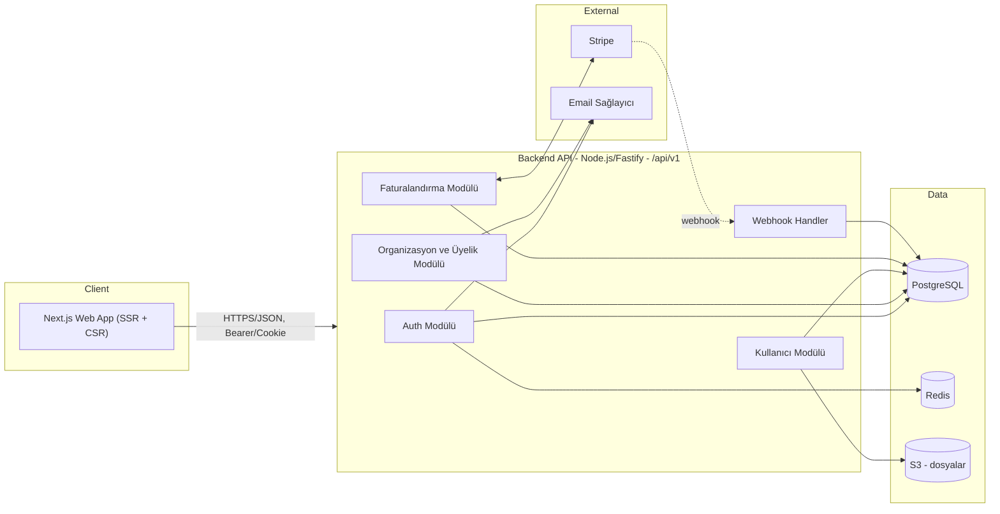

# Mimari Plan — SaaS / Kurumsal Uygulama

Durum: Taslak v1 · Sahibi: Mimar (Ekip Lideri) · Tüketiciler: `frontend-agent`, `backend-agent`

Bu doküman frontend ve backend ajanlarının bağımsız çalışıp birbiriyle uyumlu kod
üretebilmesi için sözleşme (contract) niteliğindedir. API şekli değişirse önce bu
dosya ve `openapi.yaml` / `shared-types.ts` güncellenir, sonra kod yazılır.

## 1. Kapsam ve varsayımlar

- Çok kiracılı (multi-tenant) bir SaaS: kullanıcılar bir veya birden fazla
  **Organizasyon**'a üye olur, her organizasyonun bir **Plan/Abonelik**i vardır.
- Standart özellik seti: kayıt/giriş, organizasyon yönetimi, üye davet/rol
  yönetimi, faturalandırma (Stripe), kullanıcı profili, dashboard.
- Somut bir ürün/domain (ör. proje yönetimi, CRM vb.) belirtilmediği için domain'e
  özel varlıklar (Project, Ticket, ...) bu plana **dahil edilmemiştir** — SaaS
  iskeletinin üstüne aynı desenle eklenmesi amaçlanmıştır.

## 2. Teknoloji yığını

| Katman | Seçim | Not |
|---|---|---|
| Frontend | Next.js 14+ (App Router), React, TypeScript, Tailwind CSS | `frontend-agent` standardı |
| Backend | Node.js + Fastify, TypeScript | `backend-agent` standardı (Node seçeneği) |
| ORM / DB | Prisma + PostgreSQL | İlişkisel, migration'lı şema |
| Cache / Oturum / Rate-limit | Redis | Refresh token deny-list, rate limit sayaçları |
| Doğrulama | Zod (ortak şema — hem FE form hem BE input validation aynı şemayı paylaşabilir) | |
| Auth | JWT (access, 15 dk, RS256) + rotasyonlu refresh token (httpOnly cookie, 30 gün) | |
| Ödeme | Stripe (Checkout + Billing Portal + Webhooks) | |
| Dosya depolama | S3 uyumlu object storage (avatar, vb.) | |
| E-posta | Resend/SES (doğrulama, davet, şifre sıfırlama) | |
| Dağıtım | Frontend: Vercel/Node edge; Backend: konteyner (Fly.io/Render/ECS) | |
| Gözlemlenebilirlik | OpenTelemetry + yapılandırılmış log (pino) | |
| Toplu içe aktarma | `saxes` (XML/WXR), `csv-parse` (CSV), `yauzl` (ZIP), `sanitize-html` (HTML) | Seçim gerekçeleri ve reddedilen alternatifler §10.8.3'te — backend-agent tek başına değiştiremez |

## 3. Sistem mimarisi



- Frontend backend'e **doğrudan DB erişimi olmadan**, yalnızca REST/JSON API
  üzerinden konuşur. Next.js Server Components/Route Handlers backend'e sunucu
  tarafında proxy yapabilir (secret tutmak için), ama iş mantığı backend'dedir.
- Backend stateless'tir; oturum durumu Redis'te (refresh token rotasyonu, rate
  limit) tutulur, yatay ölçeklenebilir.

## 4. Çok kiracılılık (multi-tenancy) modeli

- **Paylaşımlı veritabanı + `organization_id` sütunu** (row-level tenancy).
  Erken/orta ölçek SaaS için en düşük operasyonel maliyetli model; ileride
  büyük müşteriler için şema-başına-kiracıya geçiş kapıyı kapatmaz.
- Her istekte aktif organizasyon `X-Org-Id` header'ı (veya JWT içine gömülü
  `org_id` claim'i, kullanıcı org değiştirdiğinde token yenilenir) ile belirlenir.
- Backend'de her repository/sorgu katmanında zorunlu `organization_id` filtresi
  — tenant izolasyonu ORM seviyesinde (Prisma middleware) merkezi olarak uygulanır,
  her endpoint'te elle tekrarlanmaz.

## 5. Kimlik doğrulama ve yetkilendirme

- **Kayıt/giriş**: e-posta + şifre (argon2id hash). OAuth (Google) v2 kapsamında.
- **Access token**: JWT, RS256, 15 dk ömür, gövdede `sub` (userId), `org_id`,
  `role` claim'leri.
- **Refresh token**: opak, rastgele 256-bit, httpOnly + Secure + SameSite=Strict
  cookie, 30 gün, DB/Redis'te hash'lenerek saklanır, her refresh'te rotate edilir
  (tekrar kullanım tespiti = tüm oturumları iptal et).
- **CSRF**: cookie tabanlı refresh akışı için double-submit token veya
  `SameSite=Strict` + özel header kontrolü.
- **Yetkilendirme (RBAC)**: organizasyon bazlı roller — `OWNER`, `ADMIN`,
  `MEMBER`. Rol kontrolü backend'de merkezi bir guard/middleware ile yapılır;
  frontend yalnızca UI'ı role göre gizler/gösterir, gerçek yetki kontrolü asla
  istemciye güvenmez (bkz. mutfak konfigüratör projesindeki fiyat motoru
  deseni — istemci değeri her zaman sunucuda yeniden doğrulanır).
- **Site-geneli RBAC (`/admin/*` CMS uçları)**: yukarıdaki organizasyon bazlı
  RBAC'tan tamamen AYRI bir eksen — `pages`/`blog`/`media`/`settings`/`navigation`/
  `users`/`logs` gibi tek-site CMS uçlarında `User.role` (`SiteRole`:
  `ADMIN`/`EDITOR`/`VIEWER`) ve `User.status` (`SiteUserStatus`:
  `ACTIVE`/`SUSPENDED`) kullanılır. Rol/durum kasıtlı olarak JWT'ye GÖMÜLMEZ — her
  istekte `authenticate` middleware'i DB'den taze okur, böylece bir rol değişikliği
  veya askıya alma bir sonraki istekte hemen etkili olur (access token süresinin
  dolmasını beklemeden). Guard: `requireSiteRole` (bkz. `middleware/site-rbac.ts`).
  Yazma uçlarındaki (`POST`/`PATCH`/`PUT`/`DELETE`) rol eşiği: `pages`/`blog`
  oluşturma-düzenleme → `ADMIN`+`EDITOR`, silme → yalnızca `ADMIN`; `media`
  yükleme → `ADMIN`+`EDITOR`, silme → yalnızca `ADMIN`; `settings` güncelleme →
  yalnızca `ADMIN`; `navigation` (header/footer/nav yapılandırması) güncelleme →
  yalnızca `ADMIN`; `users`/`logs` → tüm uçlar yalnızca `ADMIN`.
  Sistemde en az bir aktif `ADMIN` kalması zorunlu tutulur (son admin'i düşürmek/
  askıya almak 409 CONFLICT döner); bir kullanıcı kendi hesabını askıya alamaz.
- **Audit Log**: hassas/yetkilendirme aksiyonları (`auth.login` başarı/başarısızlık,
  `user.create`/`user.role_change`/`user.status_change`, `invitation.create`/
  `invitation.accept`, `settings.update`, ve `requireSiteRole` guard'ının
  engellediği her istek — `FORBIDDEN` durumuyla otomatik) değişmez şekilde
  `AuditLog` tablosuna yazılır (bkz. `lib/audit.ts`).
  `metadata` alanına asla token/URL/şifre yazılmaz. Sadece `ADMIN` rolü
  `GET /admin/logs` ile okuyabilir (en yeni kayıt önce, `status`/`action` öneki
  ile filtrelenebilir).

## 6. Veri modeli (özet ER)


## 7. API tasarım ilkeleri

- **Base path**: `/api/v1` — büyük kırıcı değişiklikler `v2` ile yapılır.
- **Zarf (envelope)**: başarı `{ "data": ... , "meta"?: ... }`; hata
  `{ "error": { "code": string, "message": string, "details"?: object } }`.
  HTTP status kodu her zaman doğru anlamı taşır (200/201/204/400/401/403/404/409/422/429/500).
- **Sayfalama**: cursor tabanlı — `?limit=20&cursor=<opaque>` →
  `meta: { nextCursor: string | null }`.
- **Kimlik doğrulama**: `Authorization: Bearer <accessToken>` (API istemcileri) veya
  httpOnly cookie (web app SSR). Public uçlar hariç tüm uçlarda zorunlu.
- **Doğrulama**: tüm request body/query Zod şemasıyla doğrulanır; başarısızsa `422`
  ve `details` içinde alan bazlı hatalar.
- **Idempotency**: ödeme/checkout gibi durum değiştiren kritik POST'larda
  `Idempotency-Key` header desteği.
- **Rate limiting**: kullanıcı/IP başına Redis token-bucket; aşımda `429` +
  `Retry-After`.
- Tam uç nokta sözleşmesi: **[`openapi.yaml`](./openapi.yaml)** (OpenAPI 3.0).
- Paylaşılan TypeScript arayüzleri (FE ve BE aynı tipleri kullanır):
  **[`shared-types.ts`](./shared-types.ts)**.

## 8. Uç nokta özeti

| Grup | Uç nokta | Yetki |
|---|---|---|
| Auth | `POST /auth/register` | public |
| Auth | `POST /auth/login` | public |
| Auth | `POST /auth/refresh` | refresh cookie |
| Auth | `POST /auth/logout` | authenticated |
| Auth | `POST /auth/forgot-password` / `POST /auth/reset-password` | public |
| Auth | `GET /auth/me` | authenticated |
| Users | `GET/PATCH /users/me` | authenticated |
| Orgs | `POST/GET /organizations`, `GET/PATCH/DELETE /organizations/{id}` | authenticated, rol bazlı |
| Members | `GET /organizations/{id}/members`, `PATCH/DELETE /organizations/{id}/members/{userId}` | ADMIN/OWNER |
| Invitations | `POST/GET /organizations/{id}/invitations`, `POST /invitations/{token}/accept` | ADMIN/OWNER (davet gönderme); token sahibi (kabul) |
| Plans | `GET /plans` | public |
| Billing | `GET /organizations/{id}/subscription`, `POST .../checkout-session`, `POST .../portal-session` | OWNER |
| Webhooks | `POST /webhooks/stripe` | Stripe imza doğrulaması |
| Health | `GET /healthz` | public |
| AdminUsers | `GET/POST /admin/users`, `PATCH /admin/users/{id}/role`, `PATCH /admin/users/{id}/status` | site-geneli `SiteRole=ADMIN` |
| AdminUsers | `GET /admin/settings/permissions` | site-geneli `SiteRole=ADMIN` |
| Logs | `GET /admin/logs` | site-geneli `SiteRole=ADMIN` |
| Navigation | `GET /navigation` | public |
| Navigation | `GET /admin/navigation` | authenticated |
| Navigation | `PUT /admin/navigation` | site-geneli `SiteRole=ADMIN` |
| Stats | `GET /admin/stats/views` | authenticated |
| Stats | `GET /admin/stats/live-visitors` | authenticated |
| Stats | `GET /admin/stats/breakdown` | authenticated |
| System | `GET /admin/health` | site-geneli `SiteRole=ADMIN` |

> Not: `pages`/`blog`/`media`/`settings` CMS uçları (`/admin/pages`, `/admin/blog`,
> `/admin/media`, `/admin/settings`) bu tablonun ilk sürümünden sonra eklendi;
> tam sözleşmeleri için `openapi.yaml`'a bakın. Bu uçlardaki yazma işlemleri artık
> yukarıdaki site-geneli `SiteRole` guard'ına da tabidir (bkz. §5).

> Navigasyon/Header/Footer Yönetimi: `GET /navigation` (public — site
> header/nav/footer bunu okur), `GET /admin/navigation` (authenticated),
> `PUT /admin/navigation` (yalnızca `SiteRole=ADMIN`, tam değiştirme/replace
> semantiği — `navigationItems`/`socialLinks`/`footerColumns` dizileri tek bir
> transaction içinde delete-then-recreate edilir). Modeller: `NavigationItem`,
> `SocialLink` (`SocialPlatform` enum), `FooterColumn` → `FooterLink` (1-n,
> `onDelete: Cascade`); ayrıca `SiteSettings`'e `headerCtaLabel`/`headerCtaHref`/
> `footerCopyrightText` eklendi. Tam sözleşme için `openapi.yaml`'daki
> `NavigationConfig`/`UpdateNavigationConfigRequest` şemalarına bakın.

> Canlı Analytics (cihaz/ülke kırılımı + canlı ziyaretçi sayısı): `PageView`
> modeline `deviceType` (`DeviceType`: `MOBILE`/`DESKTOP`/`TABLET`/`UNKNOWN`,
> User-Agent'tan `lib/device.ts::detectDeviceType` ile) ve `country` (ISO 3166-1
> alpha-2, bilinmiyorsa `"UNKNOWN"` sentinel — NULL değil, aksi halde Postgres
> unique index'lerinde NULL'ların birbirinden farklı sayılması upsert'te çifte
> satır/race condition riski yaratır; IP'den `geoip-lite` ile — offline, harici
> API çağrısı/anahtar YOK — `lib/geo.ts::detectCountry` ile) eklendi. Bu ikisi ve
> `date` birlikte compound unique kısıtını oluşturur (`(pageId|postId, date,
> deviceType, country)`), böylece "aynı gün + aynı cihaz + aynı ülke" için
> upsert count'u artırır. `GET /admin/stats/breakdown?days=N` bu kırılımı
> `groupBy` ile özetler (ülkelerde ilk 10 + kalanı `"OTHER"` olarak toplanır).
> `GET /admin/stats/live-visitors` süreç-içi (in-memory, `lib/live-visitors.ts`)
> "son 60 saniyede view endpoint'i çağıran IP+User-Agent" sayacını döner — DAĞITIK
> DEĞİL (çoklu instance'ta her process kendi sayacını tutar, Redis gibi paylaşımlı
> bir store bu kapsamda yok), sunucu yeniden başlarsa sıfırlanır; gerçek istek
> sinyaline dayanır, uydurma/simüle veri ÜRETİLMEZ. Sistem sağlığı (`GET
> /admin/health`, yalnızca `SiteRole=ADMIN`): gerçek zamanlı DB ping (`SELECT 1`
> süresi), `pg_database_size` ile DB boyutu, `Media.sizeBytes` toplamı, Node
> `os`/`process` modüllerinden bellek/yük/uptime — hiçbir alan sabit/uydurma
> değildir. `DB_STORAGE_QUOTA_MB`/`MEDIA_STORAGE_QUOTA_MB` ortam değişkenleri
> tanımlıysa quota alanları doldurulur (frontend doluluk yüzdesi hesaplayabilir),
> tanımsızsa `null` döner (frontend yalnızca mutlak boyutu gösterir — asla
> varsayılan/sahte bir kota göstermez).

Ayrıntılı request/response şemaları için `openapi.yaml` esastır.

## 9. Frontend ↔ Backend entegrasyon kuralları (Mimar sorumluluğu)

1. **Kontrat önce yazılır**: `openapi.yaml` ve `shared-types.ts` bu dosyayla
   birlikte güncellenmeden hiçbir taraf endpoint şekli değiştirmez.
2. **Tip üretimi**: backend Zod şemalarından, frontend bunlardan türetilen
   TypeScript tiplerini kullanır (`shared-types.ts` tek doğruluk kaynağıdır);
   iki taraf da elle ikinci bir tip tanımı yazmaz.
3. **Hata sözleşmesi**: frontend her zaman `error.code` üzerinden dallanır
   (i18n mesajı FE'de tutulur), `error.message`'a UI mantığı bağlamaz.
4. **Sunucu asıl kaynak**: fiyat/limit/yetki gibi değerler her zaman backend'de
   yeniden hesaplanır/doğrulanır; frontend yalnızca gösterim/iyimser UI yapar.
5. **Çakışma çözümü**: FE ve BE farklı alan adı/şekli üretirse, bu doküman ve
   `shared-types.ts` bağlayıcıdır; farklılık tespit edilirse önce burada
   düzeltme yapılır, sonra ilgili ajan koduna yansıtılır.

## 10. "Olmazsa Olmaz" Modülleri v1 (Taslak — bağlayıcı sözleşme)

Durum: Taslak v1 · Sahibi: Mimar. Bu bölüm §5-§8'deki mevcut kurallara (site-geneli
`SiteRole` RBAC, `AuditLog`, zarf/hata sözleşmesi, cursor sayfalama) tabidir; burada
yalnızca 5 yeni modülün veri modeli ve uç noktaları tanımlanır. `db-agent`,
`backend-agent`, `security-agent`, `frontend-agent` bu bölümü tek doğruluk kaynağı
olarak kullanır — şekil değişirse önce burada güncellenir.

### 10.1 İçerik Sürüm Kontrolü (Revision History)

**Model** `ContentRevision`:
```
id            uuid PK
seq           int unique autoincrement
entityType    enum ContentEntityType { PAGE, BLOG_POST }
entityId      string            // Page.id veya BlogPost.id (FK yok — silinen içerikle
                                  // birlikte revizyonların da silinmesi Cascade ile
                                  // sağlanır: entityId'ye göre elle temizlik gerekmez,
                                  // bkz. not aşağıda)
snapshot      Json              // güncellemeden HEMEN ÖNCEKİ tam alan seti
editedById    string? FK->User  onDelete: SetNull
editedByName  string            // silinen kullanıcı için okunabilir ad snapshot'ı
createdAt     datetime @default(now())

@@index([entityType, entityId, createdAt])
```
- Not: `entityId` polymorphic olduğu için gerçek bir FK/Cascade kurulamaz; Page/BlogPost
  silindiğinde ilişkili `ContentRevision` kayıtlarını service katmanında (aynı
  transaction içinde) elle silin.
- `snapshot` şekli: Page için `{ title, slug, blocks, seoTitle, seoDescription, ogTitle,
  ogImageUrl, canonicalUrl, noIndex, translations }`; BlogPost için `{ title, slug,
  excerpt, contentHtml, coverImageUrl, categoryId, seoTitle, seoDescription, ogTitle,
  ogImageUrl, canonicalUrl, noIndex, translations }`.
- **Yazma kuralı**: `PATCH /admin/pages/{id}` ve `PATCH /admin/blog/{id}` her
  güncellemeden önce mevcut (eski) satırın `snapshot`'ını `ContentRevision`'a yazar
  (aynı transaction). Entity başına en fazla **50** revizyon tutulur — 51. yazımda en
  eski kayıt silinir (`findMany` + `orderBy createdAt asc` + `take` fazlasını sil).
- **Uç noktalar** (yetki: ilgili entity'nin yazma eşiğiyle aynı — `ADMIN`+`EDITOR`):
  - `GET /admin/pages/{id}/revisions?limit&cursor` → `data: ContentRevision[]`
    (snapshot alanı hariç liste görünümü: id, editedByName, createdAt, seq — detay için
    ayrı çağrı), `GET /admin/pages/{id}/revisions/{revisionId}` → tam snapshot dahil.
  - `POST /admin/pages/{id}/revisions/{revisionId}/restore` → önce mevcut state'i yeni
    bir revizyon olarak kaydeder (geri dönüş de geri alınabilir olsun diye), sonra
    snapshot'ı uygular, güncel `Page` DTO'sunu döner.
  - Aynı üçlü `blog` için: `GET/POST /admin/blog/{id}/revisions[...]`.

### 10.2 Gelişmiş SEO & Social Card (Meta Management)

Yeni backend/DB işi minimal — mevcut `Page`/`BlogPost` alanlarına ekleme:
```
ogTitle        String?
ogImageUrl     String?
canonicalUrl   String?
noIndex        Boolean  @default(false)
```
(`seoTitle`/`seoDescription` `Page`'de zaten vardı; `BlogPost`'ta YOKTU — db-agent bunu da
aynı migration'a ekledi, bkz. §6 ER diyagramı.) Bu alanlar mevcut
`UpdatePageRequestSchema` / `UpdateBlogPostRequestSchema`'ya (Zod, tümü `.optional()`,
`canonicalUrl` boşsa `null`, geçerliyse `z.string().url()`) ve DTO'lara eklenir; **yeni
endpoint yok**. Public `GET /pages/{slug}` ve `GET /blog/{slug}` cevaplarına da bu
alanlar eklenir (frontend `<head>` meta/canonical/robots etiketlerini bunlardan üretir;
`noIndex=true` → `<meta name="robots" content="noindex">`).
Google SERP / Twitter / LinkedIn kart önizlemesi **saf frontend bileşeni** — form
state'inden türetilir, backend'e ihtiyaç duymaz.

### 10.3 E-posta & Bildirim Şablonu Yöneticisi

**Model** `EmailTemplate`:
```
id                  uuid PK
key                 string @unique   // "WELCOME" | "PASSWORD_RESET" | "SYSTEM_ANNOUNCEMENT"
name                string           // insan-okur ad, ör. "Hoş Geldin E-postası"
subject             string
bodyHtml            string
availableVariables  Json             // ör. ["user_name","reset_link"] — salt bilgi amaçlı
updatedById         string? FK->User onDelete: SetNull
updatedAt           datetime @updatedAt
createdAt           datetime @default(now())
```
- `prisma/seed.ts` üç varsayılan kaydı (`WELCOME`, `PASSWORD_RESET`,
  `SYSTEM_ANNOUNCEMENT`) `availableVariables` ile birlikte tohumlar.
- Değişken sözdizimi: `{{user_name}}`, `{{reset_link}}` vb. — render'da basit,
  allow-list'e dayalı string replace kullanılır (bir template engine/`eval` KULLANILMAZ
  — enjeksiyon riski).
- **Uç noktalar** (yetki: `ADMIN` — bu iletiler tüm kullanıcılara gidebildiği için
  `EDITOR` eşiği yetersiz):
  - `GET /admin/notifications/templates` → `data: EmailTemplate[]`
  - `GET /admin/notifications/templates/{key}` → `data: EmailTemplate`
  - `PATCH /admin/notifications/templates/{key}` body `{ subject?, bodyHtml? }` →
    audit log (`notifications.template_update`)
  - `POST /admin/notifications/templates/{key}/preview` body
    `{ sampleValues: Record<string,string> }` → `data: { renderedSubject, renderedHtml }`
- Gerçek e-posta gönderimi kapsam dışı (mevcut `TODO(email-provider)` — bkz.
  `auth.service.ts::forgotPassword` — geçerliliğini korur); bu modül yalnızca şablon
  CRUD + önizleme sağlar.

### 10.4 Güvenlik & 2FA (TOTP) + Aktif Oturumlar

**`User` model eklemeleri**:
```
twoFactorEnabled     Boolean   @default(false)
twoFactorSecret      String?   // AES-256-GCM ile şifrelenmiş base32 TOTP secret — DÜZ METİN SAKLANMAZ
twoFactorVerifiedAt  DateTime?
```
Şifreleme: yeni `lib/crypto.ts` (`encryptSecret`/`decryptSecret`, AES-256-GCM), anahtar
`env.ENCRYPTION_KEY` (32 byte, base64 — `.env.example`'a eklenir).

**Yeni model** `BackupCode`:
```
id        uuid PK
userId    string FK->User onDelete: Cascade
codeHash  string   // sha256(code) — argon2 gerekmez, tek kullanımlık kısa kod
usedAt    DateTime?
createdAt DateTime @default(now())

@@index([userId])
```
Etkinleştirmede 10 adet insan-okur kod (ör. `XXXX-XXXX`) üretilir, hash'lenip saklanır,
**düz metin yalnızca bir kez** response'ta döner.

**Login akışı değişikliği** (`auth.service.ts::login`): şifre doğrulandıktan sonra
`user.twoFactorEnabled === true` ise token çifti HEMEN verilmez; bunun yerine 5 dakika
ömürlü, `purpose: "2fa_challenge"` claim'li bir JWT (`challengeToken`) üretilip
`{ requiresTwoFactor: true, challengeToken }` (200) döner. Yeni:
`POST /auth/2fa/verify` body `{ challengeToken, code }` → `code` TOTP veya bir backup
kodu ile eşleşirse (backup kodu kullanılırsa `usedAt` işaretlenir, tek kullanımlık)
normal `login` ile aynı token çiftini üretir ve döner.

**Uç noktalar** (`/admin/settings/security/2fa/*`, hepsi `authenticate` gerektirir —
org/site-rol şartı yok, herkes KENDİ hesabı için yönetir):
- `POST .../setup` → yeni secret üretir (henüz DB'ye YAZILMAZ, JWT'ye gömülü kısa ömürlü
  `setupToken` içinde taşınır), `data: { otpauthUrl, qrCodeDataUrl, setupToken }`.
- `POST .../enable` body `{ setupToken, code }` → doğrularsa `twoFactorSecret`
  (şifreli) + `twoFactorEnabled=true` yazar, 10 backup kodu üretir, `data: { backupCodes: string[] }`
  döner (audit: `security.2fa_enable`).
- `POST .../disable` body `{ password }` → şifre doğrulaması ister, 2FA'yı kapatır,
  `BackupCode` kayıtlarını siler, **mevcut oturum hariç** tüm `RefreshToken`'ları iptal
  eder (audit: `security.2fa_disable`).
- `POST .../backup-codes/regenerate` body `{ password }` → eskileri geçersiz kılar, 10
  yeni kod döner (audit: `security.2fa_backup_codes_regenerate`).

**Aktif oturumlar** (`/admin/settings/security/sessions`, yeni tablo GEREKMEZ —
`RefreshToken.userAgent`/`ipAddress` zaten var):
- `GET .../sessions` → `data: Session[]` (`id, userAgent, ipAddress, createdAt,
  expiresAt, isCurrent`) — yalnızca `revoked=false && expiresAt > now()`.
- `DELETE .../sessions/{id}` → o oturumu iptal eder (audit: `security.session_revoke`).
- `POST .../sessions/revoke-others` → mevcut hariç tümünü iptal eder.
- "Mevcut oturum" tespiti: istek cookie'sindeki ham refresh token hash'i ile eşleşen
  kayıt `isCurrent: true`.

Yeni bağımlılıklar (backend): `otplib` (TOTP), `qrcode` (PNG data URI üretimi).

### 10.5 Çoklu Dil & Yerelleştirme (i18n)

**İçerik çevirisi** — yeni tablo yerine mevcut JSON-alan deseniyle tutarlı, tek ek
alan: `Page` ve `BlogPost`'a `translations Json @default("{}")`. Şekil:
```ts
type Translations = {
  EN?: {
    title?: string; seoTitle?: string; seoDescription?: string; ogTitle?: string;
    canonicalUrl?: string;
    blocks?: unknown[];       // yalnızca Page
    excerpt?: string; contentHtml?: string;  // yalnızca BlogPost
  };
};
```
TR = kanonik/varsayılan (mevcut kolonlar), `translations.EN` yalnızca override'ları
taşır (kısmi olabilir — eksik alan TR'ye düşer). `PATCH` endpoint'leri body'de
`translations?: Translations` alanını **shallow merge** ile kabul eder (tam replace
DEĞİL — `EN` objesi kendi içinde tam replace, ama TR kolonlarını etkilemez).
Public okuma: `GET /pages/{slug}?locale=EN` / `GET /blog/{slug}?locale=EN` — alan
bazlı fallback (EN'de olmayan alan TR'den gelir); `locale` verilmezse/`TR` ise
kolonlar direkt döner.

**Admin panel arayüz dili** (chrome/UI metinleri, içerikten bağımsız) — backend işi
YOK, saf frontend: `localStorage` (`adminLocale`, `"tr"|"en"`) + basit
`I18nProvider`/`useT()` context'i (iki küçük sözlük dosyası). Yeni bağımlılık (ör.
`next-intl`) eklenmez — kapsam admin chrome'u ile sınırlı, routing gerektirmez.
`AdminTopbar`'a dil seçici (bayrak/kısaltma) eklenir.

### 10.6 Hesap Ayarları ("Hesabım") + Global Bildirim (Toast) Standardı

**Şema değişikliği GEREKMEZ.** `User.name` ve `User.avatarUrl` zaten mevcut;
`AuditLog.action` serbest `String` (enum değil), yeni action ismi için migration
gerekmez. db-agent bu iş için devreye GİRMEZ.

**Uç noktalar** (`/users/*`, `authenticate` yeterli — herkes yalnızca KENDİ hesabını
yönetir, site-rol şartı YOK):
- `PATCH /users/me` (MEVCUT) → `{ name?, avatarUrl? }`. **Sözleşme düzeltmesi:**
  `avatarUrl` artık `string | null`; `null` avatarı kaldırır. Boş string `""`
  GEÇERSİZDİR (422) — istemci `""` yerine `null` göndermelidir.
- `POST /users/me/change-password` (YENİ) → body `{ currentPassword, newPassword }`,
  başarıda **204** (gövde yok).
  - `currentPassword` argon2 (`lib/password.ts::verifyPassword`) ile doğrulanır;
    hatalıysa `401 UNAUTHORIZED` ("Şifre hatalı.") + audit `status: FAILURE`.
  - `newPassword`: min 8 karakter (`RegisterRequest.password` ile aynı kural);
    `newPassword === currentPassword` ise `422` (`details.newPassword`).
  - Başarıda `passwordHash` güncellenir ve **mevcut oturum HARİÇ** tüm
    `RefreshToken` kayıtları `revoked=true` yapılır — `2fa/disable` ile birebir aynı
    politika (cookie'deki ham token'ın `hashToken()` karşılığı hariç tutulur).
    Gerekçe: şifre değişiminde diğer cihazlardaki oturumlar zorla kapanmalıdır;
    isteği yapan cihazın oturumu bilinçli olarak korunur (kullanıcı kendini atmaz).
  - Audit action: `security.password_change` (`targetType: "User"`, `targetId: <kendi
    id>`; `metadata` ASLA şifre/hash içermez).
  - Rate limit: route-level `config.rateLimit = { max: 5, timeWindow: "1 minute" }` —
    `security.routes.ts::SENSITIVE_ACTION_RATE_LIMIT` ile aynı desen. Aşılırsa
    `429 RATE_LIMITED`.

**Frontend yerleşimi**: `/admin/account` ROUTE'u (modal DEĞİL). Gerekçe: üç ayrı
bölüm (profil / avatar / şifre) + `MediaPicker` gibi kendi başına modal açan bir alt
bileşen içerir; modal-içinde-modal deseninden kaçınılır ve `/admin/settings/security`
ile aynı "kişisel hesap" bilgi mimarisi korunur. Şifre değiştirme formu bu sayfa
İÇİNDE bir `Card`'dır (2FA disable'daki gibi ayrı bir `Dialog` değil) — sayfanın
kendisi zaten kimliği doğrulanmış özel bir alandır.

**Toast standardı** (`sonner`, `providers.tsx`'te mount edilmiş — yeni altyapı YOK):
kullanıcı tarafından TETİKLENEN her mutasyon (create/update/delete/restore/bulk)
sonucunda tam olarak bir toast gösterilir.
- Başarı: `toast.success("<Varlık> <fiil geçmiş zaman>.")` — ör. "Yazı oluşturuldu."
- Hata: `toast.error(friendlyErrorMessage(err))`.
- Toast, mevcut inline `Alert`/`saveError` gösterimini KALDIRMAZ; kalıcı bağlam için
  inline hata korunur, toast anlık geri bildirimdir (mevcut `settings/page.tsx`
  deseni referanstır).
- İSTİSNA: kullanıcı tetiklemeyen arka plan yüklemeleri (`load()`, liste/polling
  hataları) toast ÜRETMEZ — bunlar inline `Alert` ile gösterilir.

### 10.7 İçerik Yönetim Listesi (WordPress-tarzı Sayfalar & Blog tablosu)

Sayfalar (`Page`) ve Blog Yazıları (`BlogPost`) admin liste ekranları ORTAK bir tablo
bileşeni kullanır. İki varlık için sözleşme **birebir simetriktir** — endpoint isimleri,
gövde şekilleri, hata kodları ve DTO alanları aynıdır; farklı olan tek şey yol öneki
(`/admin/pages` vs `/admin/blog`) ve SEO skorunun entity'ye özgü girdileridir.
Bağlayıcı kaynak: `openapi.yaml` (tag `Pages` / `Blog`).

**Şema (db-agent):**
- `Page`: `deletedAt DateTime?`, `authorId String?` + `author User? @relation(..., onDelete: SetNull)`;
  `User` tarafına karşı-ilişki `pages Page[]`. İndeksler: `@@index([deletedAt, status])`,
  `@@index([authorId])`.
- `BlogPost`: `deletedAt DateTime?` (author ilişkisi ZATEN VAR). Aynı iki indeks.
- `slug` tekilliği çöptekileri DE kapsar (unique constraint dokunulmaz). Çöpe taşırken
  slug yeniden adlandırılmaz; çakışan yeni kayıt `409 CONFLICT` alır ve mesaj kullanıcıyı
  çöpe yönlendirir. Otomatik çöp temizleme (retention cron) v1 KAPSAM DIŞI.

**Soft-delete (çöp kutusu):**
- `DELETE /admin/{pages|blog}/{id}` artık `deletedAt = now()` yapar (KALICI SİLMEZ) ve
  yetki eşiği ADMIN-only'den **ADMIN/EDITOR**'e genişler.
- `DELETE .../{id}/permanent` (ADMIN-only) kalıcı siler; kayıt ÖNCE çöpte olmalıdır,
  değilse 409. `ContentRevision` satırları polymorphic olduğu için FK cascade YOKTUR →
  aynı transaction içinde elle silinir.
- Çöpe taşınan sayfa `SiteSettings.homePageId` ise aynı transaction'da `homePageId = null`
  yapılır; geri yükleme bunu geri almaz.
- **Tüm public okuma yolları `deletedAt: null` filtresi eklemek ZORUNDADIR**
  (`publicPagesRoutes`, `publicBlogRoutes`, view sayacı upsert'leri,
  `settings.routes.ts` homePage sorgusu, sitemap/feed üreten her yer).
- Çöpteki içerik DÜZENLENEMEZ: `PATCH .../{id}` → 409.

**Sekme sayaçları — sunucu tarafı (karar):** `GET /admin/{pages|blog}` yanıtı
`meta.counts { all, published, draft, trashed }` döner; tek `groupBy` ile tablo genelinde
hesaplanır ve istek filtrelerinden etkilenmez. Gerekçe: `limit` tavanı 100'dür, client
tarafında sayım 100+ kayıtta yanlış sonuç verirdi. Satır filtreleme/arama/sayfalama ise
MEVCUT desende (`useFilteredList`, client-side) kalır — frontend `?trashed=include&limit=100`
çeker, gerekiyorsa `meta.nextCursor` boşalana dek döngüyle devam eder.

**Hızlı Düzenle (Quick Edit):** AYRI UÇ YOKTUR. Inline mini form mevcut
`PATCH .../{id}` ucunu `{ title?, slug?, status? }` kısmi gövdesiyle çağırır — slug
tekilliği, revizyon snapshot'ı (§10.1) ve `publishedAt` mantığı tek yerde kalsın diye.
Taslağa alma `publishedAt`'i temizlemez (ilk yayın tarihi kalıcıdır).

**Toplu işlem:** `POST /admin/{pages|blog}/bulk` → `{ ids[1..100], action }`,
action ∈ `trash | restore | publish | draft | permanent-delete`. Kısmi başarı hata
değildir (200 + `skippedIds`). "Çöpü Boşalt" ayrı uç değildir; frontend çöpteki id'leri
`permanent-delete` ile gönderir.

**Yazar:** `authorId` create/update gövdelerine eklenir. Verilmezse giriş yapmış
kullanıcı; BAŞKA kullanıcı atamak/değiştirmek yalnızca **ADMIN** (EDITOR → 403).
Dropdown mevcut `GET /admin/users` ile beslenir, YENİ UÇ YOKTUR (zaten ADMIN-only, bu da
"yalnızca ADMIN atayabilir" kuralıyla örtüşür). Eski kayıtlar için backfill yapılmaz →
`author: null`, UI "—" gösterir.

**SEO tamlık skoru:** BACKEND hesaplar (frontend yalnızca render eder), her okumada
saf/senkron olarak üretilir, persist EDİLMEZ. `seoScore: 0..100` + `seoScoreIssues:
{ code, label }[]`. `code` kararlı makine-okunur anahtardır (frontend mantığı ve testler
buna bağlanır), `label` gösterime yönelik Türkçe metindir. 5 kriter × 20 puan ve tam
eşikler `openapi.yaml#/components/schemas/SeoScoreIssue` açıklamasındadır (bağlayıcı).
Rozet renkleri: <50 kırmızı, 50–79 sarı, ≥80 yeşil (ui-designer token'ları).

**Tarih sütunu:** yeni alan gerekmez — `status=PUBLISHED && publishedAt != null` ise
"Yayınlandı — {publishedAt}", çöpteyse "Çöpe taşındı — {deletedAt}", aksi halde
"Son Düzenleme — {updatedAt}".

**Audit:** `page.trash|restore|permanent_delete|bulk_<action>` ve `blog_post.*`
karşılıkları yazılır (`AuditLog.action` serbest string, migration gerekmez).

### 10.8 Toplu İçe Aktarma (Import) + Dışa Aktarma

Durum: v1 · Sahibi: Mimar. Bağlayıcı kaynak: `openapi.yaml` (tag `Import`). Bu bölüm
`db-agent`, `backend-agent`, `frontend-agent`, `security-agent`, `qa-agent` için tek
doğruluk kaynağıdır.

#### 10.8.1 Arka plan işleme kararı — kuyruk YOK, süreç-içi worker + DB durum tablosu

Projede BullMQ/Redis/kuyruk altyapısı **yoktur** ve v1'de **kurulmayacaktır**. Karar:
`ImportJob` satırı doğruluk kaynağı, işleme aynı Node sürecinde asenkron yürür.

- `POST .../start` `QUEUED` yazar, `202` döner ve worker'ı `setImmediate` ile tetikler —
  istek/yanıt döngüsünü BEKLETMEZ.
- **Eşzamanlılık 1**: modül-düzeyi FIFO; ikinci iş `QUEUED`'da bekler. Gerekçe: bellek ve
  DB yükünü sınırlamak; içe aktarma nadir, uzun ve I/O-yoğun bir işlemdir.
- **Parti (batch) boyutu 25**: her 25 kayıtta bir sayaçlar (`processedCount`,
  `successCount`, `errorCount`, `skippedCount`) DB'ye yazılır → poll eden UI ilerlemeyi
  görür. Aynı noktada `cancelRequestedAt` kontrol edilir (işbirlikçi iptal).
- **Çökme/restart kurtarma (ZORUNLU)**: `app.addHook("onReady")` içinde
  `status IN (QUEUED, PROCESSING)` olan tüm işler `FAILED` + `errorSummary: "Sunucu
  yeniden başlatıldığı için içe aktarma yarıda kaldı."` yapılır. Bu OLMADAN iş sonsuza
  dek `PROCESSING`'de asılı kalır ve UI sonsuz poll eder.
- **Bilinen sınır (kabul edildi)**: süreç-içi worker **tek instance** varsayar. Yatay
  ölçeklemede (birden fazla API replikası) `onReady` kurtarması komşu instance'ın canlı
  işini yanlışlıkla `FAILED` yapar. Ölçeklendiğimiz gün BullMQ'ya geçilir; **API kontratı
  ve `ImportJob` tablosu AYNEN KALIR**, yalnızca tetikleyici (`setImmediate` → `queue.add`)
  değişir. Bu, kararı geri alınabilir kılar — kuyruğu şimdi kurmamanın gerekçesi budur.
- Realtime bildirim (SSE/WebSocket) YOK: frontend `GET /admin/import/jobs/{jobId}` ucunu
  **2 sn**'de bir poll eder, iş sonlanınca §10.6 toast standardıyla bildirim gösterir.

#### 10.8.2 Şema (db-agent — TEK SAHİP)

```prisma
enum ImportJobType         { PAGES  BLOG  WORDPRESS  USERS  MEDIA }
enum ImportSourceFormat    { CSV  JSON  XML  ZIP }
enum ImportJobStatus       { PENDING  QUEUED  PROCESSING  COMPLETED  FAILED  CANCELLED }
enum ImportDuplicateStrategy { SKIP  OVERWRITE  CREATE_NEW }
enum ImportErrorSeverity   { ERROR  SKIPPED }

model ImportJob {
  id                String     @id @default(uuid())
  seq               Int        @unique @default(autoincrement())   // cursor sayfalama
  type              ImportJobType
  format            ImportSourceFormat
  status            ImportJobStatus @default(PENDING)
  duplicateStrategy ImportDuplicateStrategy?                        // PENDING iken null
  // Kullanıcının yüklediği ORİJİNAL ad — yalnızca gösterim.
  filename          String
  // Gizli depodaki dosya referansı (rastgele UUID adı / S3 key). API'de ASLA DÖNMEZ.
  storagePath       String?
  sizeBytes         Int
  // Onay ekranını besleyen önizleme (openapi #/components/schemas/ImportJobPreview).
  preview           Json?
  // Başlatırken seçilen alan eşleştirmesi + defaultStatus/defaultAuthorId/defaultCategoryId.
  options           Json       @default("{}")
  totalCount        Int        @default(0)
  processedCount    Int        @default(0)
  successCount      Int        @default(0)
  errorCount        Int        @default(0)
  skippedCount      Int        @default(0)
  // Yalnızca işin TAMAMINI başarısız kılan hata; satır hataları ImportJobError'dadır.
  errorSummary      String?
  createdById       String?
  cancelRequestedAt DateTime?
  startedAt         DateTime?
  finishedAt        DateTime?
  createdAt         DateTime   @default(now())
  updatedAt         DateTime   @updatedAt

  createdBy User?             @relation("ImportJobCreator", fields: [createdById], references: [id], onDelete: SetNull)
  errors    ImportJobError[]

  @@index([status])
  @@index([type])
  @@index([createdById])
  @@map("import_jobs")
}

model ImportJobError {
  id          String   @id @default(uuid())
  seq         Int      @unique @default(autoincrement())
  jobId       String
  // Kaynak dosyadaki 1-tabanlı sıra (CSV'de başlık satırı HARİÇ).
  rowNumber   Int
  // openapi #/components/schemas/ImportJobErrorCode ile BİREBİR — serbest string DEĞİL.
  code        String
  message     String
  severity    ImportErrorSeverity @default(ERROR)
  field       String?
  // WXR'da wp:post_id, ZIP'te arşiv içi dosya adı, CSV/JSON'da slug/email.
  sourceRef   String?
  // Satırın ham hâli, 8 KB'a KIRPILIR. KİŞİSEL VERİ İÇEREBİLİR (bkz. 10.8.8).
  rawData     Json?
  createdAt   DateTime @default(now())

  job ImportJob @relation(fields: [jobId], references: [id], onDelete: Cascade)

  @@index([jobId, seq])
  @@map("import_job_errors")
}
```
`User` tarafına karşı-ilişki alanı: `importJobs ImportJob[] @relation("ImportJobCreator")`.

- **Hata satırı tavanı 1.000/iş** — aşıldığında YAZMA DURUR (`errorCount` saymaya devam
  eder), `GET .../errors` `meta.truncated: true` döner. Bozuk bir 5.000 satırlık CSV'nin
  DB'yi doldurması böylece engellenir.
- **`code` neden String, enum değil?** Kod listesi (`ImportJobErrorCode`) uygulama
  geliştikçe sık büyür; her yeni kod için migration gerekmesin diye `AuditLog.action` ile
  aynı desen kullanılır. Bağlayıcı liste `openapi.yaml`'dadır ve Zod ile doğrulanır.

#### 10.8.3 Kütüphane seçimleri (bağlayıcı — backend-agent kendi başına değiştiremez)

| İş | Seçim | Gerekçe / reddedilenler |
|---|---|---|
| XML/WXR | **`saxes@^6`** | Streaming SAX → bellek dosya boyutundan BAĞIMSIZ (aynı anda tek `<item>` RAM'de). Saf ayrıştırıcı, hiç I/O yapmaz → dış varlık (XXE) çözümlemesi yapısal olarak İMKÂNSIZ. CJS + gömülü tipler, tek bağımlılık (`xmlchars`). **Ret:** `fast-xml-parser` (DOM tabanlı, tüm dosya bellekte; iç DTD varlıklarını genişletir → billion-laughs yüzeyi), `xml2js` (DOM kurar, bakımsız), `libxmljs`/`node-expat` (native binding, GERÇEK XXE yüzeyi). |
| ZIP | **`yauzl@^3`** | Merkezi dizini okur, girişleri tembel/streaming açar, kendiliğinden diske YAZMAZ → zip-slip ancak biz arşivdeki adı yola koyarsak mümkün olur (koymuyoruz, kendi UUID adımızı üretiyoruz). **Ret:** `adm-zip` (arşivi tümüyle belleğe alır, geçmiş zip-slip CVE'leri), `unzipper` (daha ağır, daha çok bağımlılık). |
| CSV | **`csv-parse@^7`** | BOM (`bom: true`), tırnaklı alan, gömülü `,`/`\n`/`\r\n`, `relax_column_count`, hem sync (önizleme) hem stream (çalıştırma) API'si, bağımlılıksız. **Ret:** elle `split(",")` — kendi dışa aktarıcımız (`export-csv.ts`) tırnaklı alan üretiyor, elle bölme kendi çıktımızı bile okuyamazdı. |
| JSON | Kütüphane YOK | Boyut-kapalı buffer üzerinde `JSON.parse` + Zod. |
| HTML temizleme | **`sanitize-html@^2`** | Aşağıya bakınız — v1'in en kritik güvenlik gereksinimi. |

#### 10.8.4 HTML sanitizasyonu (ZORUNLU — yeni bir güvenlik gereksinimi)

Bugün projede **hiçbir HTML sanitizasyonu yoktur** (`grep`: 0 sonuç) ve
`BlogPost.contentHtml` ile `Block{type:"text"}.data.html` public sitede
`dangerouslySetInnerHTML` ile render edilir
(`frontend/src/app/(site)/blog/[slug]/page.tsx`, `components/site/blocks/text-block.tsx`).
Bu bugüne kadar kabul edilebilirdi çünkü tek yazar GÜVENİLEN ADMIN/EDITOR'dü.

**İçe aktarma bu güven modelini bozar**: WXR/CSV/JSON içeriği yabancı (belki ele
geçirilmiş) bir siteden gelir. Bu yüzden:

- İçe aktarılan HER HTML alanı (`content:encoded`, `excerpt:encoded`, CSV/JSON'daki
  `contentHtml`) DB'ye yazılmadan ÖNCE **sunucu tarafında** `sanitize-html` ile
  temizlenir. Yalnızca sunucu tarafı geçerlidir — istemci temizliği güvenlik değildir.
- İzin listesi (allow-list) yaklaşımı: `<script>`, `<style>`, `<iframe>`, `<object>`,
  `<embed>`, `<form>`, tüm `on*` öznitelikleri ve `javascript:`/`data:` URL şemaları
  REDDEDİLİR.
- WordPress kısa kodları (`[gallery ...]`, `[caption ...]`) düz metin olarak KALIR (v1'de
  yorumlanmaz); zararsızdır, ayrı uyarı gerekmez.
- **security-agent'a ayrı görev (bu işten BAĞIMSIZ bulgu):**
  `media.routes.ts::ALLOWED_MIME_TYPES` bugün `image/svg+xml`'e izin veriyor ve
  `/uploads/*` aynı origin'den servis ediliyor → mevcut doğrudan yükleme yolunda
  depolanmış XSS riski. İçe aktarma tarafında SVG kesin olarak REDDEDİLİR
  (`MEDIA_SVG_REJECTED`).

#### 10.8.5 Yükleme, boyut limitleri ve dosyanın nerede durduğu

- **Global multipart limiti route-level override edilir.** `plugins/uploads.ts`
  `@fastify/multipart`'ı `{ fileSize: 5MB, files: 1 }` ile GLOBAL kaydediyor.
  `@fastify/multipart` v10, `request.file(opts)` / `request.parts(opts)` ile verilen
  seçenekleri plugin seçeneklerinin ÜZERİNE deep-merge eder
  (`node_modules/@fastify/multipart/index.js::handleMultipart`) → route içinde
  `request.file({ limits: { fileSize: N, files: 1, fields: 5 } })` yeterlidir; plugin'i
  değiştirmeye GEREK YOKTUR (ve değiştirilMEmelidir — medya yükleme 5 MB'da kalmalı).
- **`app.ts`'teki global `bodyLimit` de aşılmalıdır**: `bodyLimit: MAX_UPLOAD_BYTES + 64KB`
  Fastify core seviyesinde uygulanır ve büyük istekleri multipart'a ULAŞMADAN 413 ile
  keser (bkz. `app.ts` içindeki mevcut yorum). Bu yüzden içe aktarma route'ları
  **route-level `bodyLimit`** de tanımlar. İkisi birlikte yapılmadan 5 MB'ın üstü çalışmaz.
- Tip başına dosya limiti: `PAGES`/`BLOG`/`USERS` **10 MB** · `WORDPRESS` **50 MB** ·
  `MEDIA` **100 MB**. Kayıt tavanı: `USERS` 500 · `PAGES`/`BLOG` 5.000 · `WORDPRESS`
  10.000 item · `MEDIA` 500 dosya.

**413/422 kararı (mimar hakemliği — proje geneli kural):** Boyut aşımı **HER ZAMAN 413
`PAYLOAD_TOO_LARGE`**'dır, 422 değil. RFC 9110 §15.5.14 gereği 413 tam olarak bu durum
içindir; 422 ise iyi biçimlendirilmiş ama anlamsal olarak geçersiz bir GÖVDE içindir —
çok büyük bir dosya bir alan doğrulama hatası değil, taşıma seviyesinde bir limit
ihlalidir.

Bu, `plugins/error-handler.ts`'te **var olan bir tutarsızlığı da düzeltir**: aynı dosyada
`FST_ERR_CTP_BODY_TOO_LARGE` → 413 iken hemen üstündeki `FST_REQ_FILE_TOO_LARGE` → 422
map ediliyor. İkisi de aynı sınıf hatadır ve aynı statüyü dönmelidir.

Route-local kontrol tek başına YETERSİZDİR ve bu bir varsayım değil, doğrulanmış bir
davranıştır: `@fastify/multipart`'ta `throwFileSizeLimit` varsayılanı `true`'dur
(`index.js:172-174`), bu yüzden 100 MB'lık sert tavan aşıldığında `file.on("limit")` →
`onError(RequestFileTooLargeError)` tetiklenir ve hata `cleanup()` → `ch(lastError)`
yoluyla `for await (const part of parts)` döngüsünden **fırlar** — yani route içindeki
tip-bazlı boyut kontrolüne HİÇ ULAŞILMAZ. Sonuç bugün: 100 MB üstü bir yükleme
`422` + `"En fazla 5MB yükleyebilirsiniz."` döner (hem yanlış statü hem yanlış mesaj).

Bu yüzden **her iki katman da gereklidir**:
1. **Global handler** (`error-handler.ts`): `FST_REQ_FILE_TOO_LARGE` → **413
   `PAYLOAD_TOO_LARGE`**, limitten bağımsız/genel bir mesajla (sabit "5MB" metni
   KALDIRILIR — import route'larında yanlıştır). Bu emniyet ağıdır ve ileride eklenecek
   her multipart route'u otomatik kapsar; "type-aware" bir dallanmaya GEREK YOKTUR.
2. **Route-local kontrol** (mevcut `import.routes.ts` yaklaşımı — **ONAYLANDI**):
   tip-bazlı gerçek limiti ve kullanıcıya gösterilecek spesifik mesajı üretir
   (`PayloadTooLargeError`).

Etki alanı denetlendi ve dar: `/admin/media` `openapi.yaml`'da HİÇ tanımlı değil (ayrı
bir kontrat boşluğu — documentation-agent'a not), hiçbir test 422 beklemiyor ve frontend
`friendly-error.ts` yalnızca `error.message`/`details` gösteriyor, statüye göre
dallanmıyor (`PAYLOAD_TOO_LARGE` zaten `frontend/src/lib/api/types.ts`'te tanımlı).
- **Kaynak dosya `uploads/` altına YAZILAMAZ.** `UPLOAD_DIR`, `@fastify/static` ile
  **auth'suz, herkese açık** servis ediliyor; bir WXR/CSV e-posta adresleri ve
  yayınlanmamış taslaklar içerir. İçe aktarma dosyaları ayrı, public OLMAYAN bir yere
  yazılır: `IMPORT_DIR = <cwd>/storage/imports` (local) veya S3'te `imports/` ön eki
  (private ACL, URL üretilmez). Dosya adı `randomUUID()`'dir; kullanıcının verdiği ad
  ASLA yola konmaz. `lib/storage/*` (MediaStorage) bilinçli olarak **kullanılmaz** — o
  soyutlama public bir `url` döndürmek üzere tasarlanmıştır.
  → **devops-agent**: `storage/imports` için `uploads/` ile aynı şekilde volume mount +
  `.gitignore` girdisi + Dockerfile'da klasör oluşturma gerekir.
- **Yaşam süresi**: kaynak dosya iş `COMPLETED|FAILED|CANCELLED` olur olmaz silinir.
  Onaylanmamış `PENDING` işler 24 saat sonra süpürülür — **cron YOK**, süpürme her yeni
  yüklemede tembel (lazy) olarak tetiklenir.

#### 10.8.6 WordPress WXR eşleştirmesi (backend-agent tahmin YÜRÜTMEZ)

WXR, RSS 2.0'ın WordPress ad alanlarıyla genişletilmiş hâlidir. Ad alanı **URI**'leriyle
eşleştirilir, `wp:`/`content:` **ön ekleriyle DEĞİL** (ön ek dosyadan dosyaya değişebilir)
→ `saxes` `{ xmlns: true }` ile kurulur. 1.0/1.1/1.2 URI'lerinin üçü de kabul edilir.

| Ön ek | Ad alanı URI |
|---|---|
| `wp` | `http://wordpress.org/export/1.2/` (ve `.../1.0/`, `.../1.1/`) |
| `excerpt` | `http://wordpress.org/export/1.2/excerpt/` |
| `content` | `http://purl.org/rss/1.0/modules/content/` |
| `dc` | `http://purl.org/dc/elements/1.1/` |
| `wfw` | `http://wellformedweb.org/CommentAPI/` (yok sayılır) |

**Kanal (channel) düzeyi** — `<item>`'lardan önce toplanır:
- `wp:author` → `{ wp:author_login → wp:author_email, wp:author_display_name }` sözlüğü.
  Yalnızca yazar çözümlemesi için kullanılır; **kullanıcı OLUŞTURMAZ**.
- `wp:category` → `{ wp:cat_name (görünen ad), wp:category_nicename (slug) }` →
  `BlogCategory` upsert (`slug` üzerinden). `wp:category_parent` YOK SAYILIR (şemamızda
  kategori hiyerarşisi yok).
- `wp:tag` / `wp:term` → YOK SAYILIR (etiket modelimiz yok) → `WP_TAGS_UNSUPPORTED` uyarısı.

**`wp:post_type` yönlendirmesi:** `post` → `BlogPost` · `page` → `Page` ·
`attachment` → yalnızca URL sözlüğüne (aşağıya bkz.) · `nav_menu_item`, `revision`,
`custom_css`, `wp_global_styles`, `wp_block`, `wp_navigation` ve diğer her şey → ATLANIR
(`UNSUPPORTED_POST_TYPE`, `skippedCount`).

**`wp:status` → `PageStatus`:** `publish` → `PUBLISHED` · `draft`/`pending`/`auto-draft`
→ `DRAFT` · `private` → `DRAFT` + `WP_PRIVATE_AS_DRAFT` uyarısı (özel/private durumumuz
yok) · `future` → `DRAFT` + `WP_SCHEDULED_AS_DRAFT` (zamanlanmış yayın desteklenmiyor) ·
`trash`/`inherit` → ATLANIR.

**`<item>` alan eşleştirmesi:**

| WXR alanı | Hedef (BlogPost) | Hedef (Page) | Kural |
|---|---|---|---|
| `title` | `title` | `title` | ZORUNLU; boşsa satır hatası `REQUIRED_FIELD_MISSING` |
| `wp:post_name` | `slug` | `slug` | URL-decode edilir; boşsa `slugify(title)`; çakışma → `duplicateStrategy` |
| `content:encoded` | `contentHtml` | `blocks` | Page'de tek blok: `[{ id: uuid(), type: "text", data: { html } }]`. **Her iki durumda da sanitize edilir (10.8.4).** |
| `excerpt:encoded` | `excerpt` | — | Boşsa `null`. Page'de karşılığı YOK, yok sayılır |
| `wp:status` | `status` | `status` | Yukarıdaki eşleme |
| `wp:post_date_gmt` (yoksa `wp:post_date`) | `publishedAt` | `publishedAt` | Yalnızca `status = PUBLISHED` ise. **`"0000-00-00 00:00:00"` WordPress'in NULL sentinel'idir → `null` sayılır.** Geçersiz tarih → `INVALID_DATE`, satır yine yazılır (`publishedAt: null`) |
| `dc:creator` (author_login) | `authorId` | `authorId` | `wp:author` sözlüğünden e-posta bulunur → `User.email` (case-insensitive) araması. Eşleşme yoksa `options.defaultAuthorId`, o da yoksa `null` + `WP_AUTHOR_UNMATCHED` uyarısı. **ASLA kullanıcı oluşturmaz.** |
| `<category domain="category" nicename="...">` | `categoryId` | — | İLK eşleşen kullanılır (şemada tek kategori). `nicename` → `BlogCategory.slug` upsert, CDATA metni → `name` |
| `<category domain="post_tag">` | — | — | Yok sayılır (`WP_TAGS_UNSUPPORTED`) |
| `wp:postmeta[_thumbnail_id]` | `coverImageUrl` | `ogImageUrl` | Değer = attachment'ın `wp:post_id`'si → o attachment item'ının `wp:attachment_url`'ü. **İki geçişli**: attachment'lar yazılardan SONRA gelebilir, bu yüzden `post_id → attachment_url` sözlüğü önizleme (1. geçiş) sırasında kurulur |
| `wp:postmeta[_yoast_wpseo_title]` \| `[rank_math_title]` | `seoTitle` | `seoTitle` | |
| `[_yoast_wpseo_metadesc]` \| `[rank_math_description]` | `seoDescription` | `seoDescription` | |
| `[_yoast_wpseo_canonical]` \| `[rank_math_canonical_url]` | `canonicalUrl` | `canonicalUrl` | Geçersiz URL → `null` (satır hatası değil) |
| `[_yoast_wpseo_meta-robots-noindex] == "1"` \| `[rank_math_robots]` içinde `noindex` | `noIndex` | `noIndex` | Aksi hâlde `false` |
| `[_yoast_wpseo_opengraph-title]` \| `[rank_math_facebook_title]` | `ogTitle` | `ogTitle` | |
| `[_yoast_wpseo_opengraph-image]` \| `[rank_math_facebook_image]` | `ogImageUrl` | `ogImageUrl` | |
| `wp:post_id`, `guid`, `link` | — | — | Kolon olarak SAKLANMAZ; hata satırlarında `sourceRef` olarak izlenebilirlik sağlar |
| `wp:comment*`, `wp:is_sticky`, `wp:menu_order`, `wp:ping_status`, `wp:comment_status`, `wp:post_password`, `wp:post_parent` | — | — | Yok sayılır |

**Medya (attachment) kararı — v1'de dosya İNDİRİLMEZ.** `wp:attachment_url` kaynak siteyi
gösterir. Sunucudan uzak URL indirmek **SSRF** (iç ağ / cloud metadata servisi taraması)
ve sınırsız süre/bant genişliği demektir. v1: `coverImageUrl` ve `content:encoded`
içindeki `` **orijinal uzak URL olarak kalır**; `Media` kaydı OLUŞTURULMAZ.
Önizleme `WP_MEDIA_NOT_DOWNLOADED` uyarısıyla bunu açıkça söyler ("N medya bağlantısı
kaynak siteye işaret ediyor, görseller taşınmaz"). Görselleri taşımak isteyen kullanıcı,
WordPress medya klasörünü ZIP'leyip `MEDIA` içe aktarımını kullanır. İleride
`downloadMedia` bayrağı eklenirse allow-list + DNS rebinding koruması + boyut/süre limiti
ZORUNLU olur.

**Güvenlik — XXE / billion-laughs (security-agent denetler):**
1. Ayrıştırıcı seçimi (`saxes`) dış varlık çözümlemesini yapısal olarak imkânsız kılar.
2. Buna EK OLARAK, ayrıştırmadan önce dosyanın ilk 64 KB'ı (prolog ve DOCTYPE ancak orada
   bulunabilir) taranır; `<!DOCTYPE` veya `<!ENTITY` görülürse dosya **422 ile reddedilir**
   (mesaj: "XML DTD/varlık tanımı içeren dosyalar güvenlik nedeniyle kabul edilmez.").
   Bu, ayrıştırıcıdan bağımsız ikinci savunma katmanıdır (defense-in-depth).
3. Derinlik/eleman sayacı: 100 seviyeden derin iç içe geçme veya 10.000'den fazla item
   → **yükleme anında 422, iş OLUŞTURULMAZ** (mimar kararı; bu madde önceden "iş `FAILED`"
   diyordu, §10.8.5'teki genel kayıt-tavanı kuralıyla çelişiyordu — genel kural geçerlidir).

**Genel ilke (tüm tipler için bağlayıcı):** Kaynak dosyadan **statik olarak** tespit
edilebilen her kusur — boyut, format uyuşmazlığı, kayıt tavanı, DTD/derinlik, ZIP bombası,
zip-slip — önizleme geçişi sırasında yakalanır ve **422 ile reddedilir, iş oluşturulmaz**
(boyut aşımı hariç: o 413'tür, bkz. §10.8.5). `FAILED` durumu YALNIZCA çalışma anında
ortaya çıkan hatalara ayrılmıştır (DB hatası, sunucu yeniden başlatma). Gerekçe: kullanıcı
hatayı anında ve düzeltilebilir biçimde görür; "iş oluştur → başlat → poll et → başarısız
olduğunu öğren" döngüsü, önizleme adımının varlık sebebini ortadan kaldırırdı. Ayrıca
`FAILED` işlerin listesi böylece gerçek operasyonel arızaların sinyali olarak kalır,
kullanıcı girdi hatalarıyla gürültülenmez.

#### 10.8.7 Tip bazlı özel kurallar

**`USERS` (CSV):** sütunlar `name,email,role` (başlıklar Türkçe olabilir, eşleştirme
`fieldMapping` ile). `role` ∈ `ADMIN|EDITOR|VIEWER` (büyük/küçük harf duyarsız); boşsa
`EDITOR` (`POST /admin/users` varsayılanıyla aynı). Kayıt akışı mevcut uçla BİREBİR
AYNIDIR: rastgele kullanılamaz şifre + şifre belirleme token'ı + e-posta. E-posta
gönderimi **satır bazında best-effort**'tur; başarısızlık kullanıcıyı SİLMEZ, satır
`EMAIL_DELIVERY_FAILED` (`severity: error`) olarak raporlanır ama kullanıcı oluşmuş kalır.
Var olan e-posta → `DUPLICATE_SKIPPED`. **`overwrite`/`createNew` YASAK (422)** — CSV ile
rol değiştirmek yetki yükseltme vektörüdür; rol değişikliği tek yolla,
`PATCH /admin/users/{userId}/role` ile yapılır. Her oluşturulan kullanıcı için `AuditLog`
`user.create` yazılır (metadata'ya `importJobId` eklenir). E-posta gönderimi 10/sn ile
kısılır (SMTP sağlayıcısı korunur).

**`MEDIA` (ZIP):**
- MIME tipi **magic bytes**'tan belirlenir, uzantıdan DEĞİL (arşiv içi ad saldırgan
  kontrolündedir). İzin verilenler `media.routes.ts::ALLOWED_MIME_TYPES` ile aynı, ANCAK
  `image/svg+xml` **hariç** → `MEDIA_SVG_REJECTED`.
- Zip bombası koruması (herhangi biri ihlal → 422, iş oluşturulmaz): giriş sayısı > 500;
  tek girişin açılmış boyutu > 5 MB; toplam açılmış boyut > 200 MB; herhangi bir girişte
  sıkıştırma oranı (açılmış/sıkıştırılmış) > 100.
- **Zip-slip koruması — TÜM ARŞİV reddedilir (mimar kararı, "fail closed").** `..`,
  mutlak yol veya sürücü harfi içeren TEK BİR giriş adı, arşivin tamamını **422** ile
  reddettirir; kalan girişler işlenmez. Bu, `yauzl@3`'ün fiili davranışıdır (giriş adını
  kendi içinde valide eder ve ilk güvensiz isimde okumayı tümüyle abort eder, `entry`
  event'i hiç emit edilmez) ve bilinçli olarak BENİMSENMİŞTİR — bypass edilip elle
  giriş-bazlı okumaya geçilMEYECEKTİR. Gerekçe: zip-slip yolu içeren bir arşiv "biraz
  kirli" bir arşiv değildir; bizi hedef alan bir araçla üretilmiştir. Böyle bir girdiye
  kısmi güven göstermek yanlış varsayılandır. Ek fayda: davranışı akıl yürütmesi ve test
  etmesi tekildir ("ya tamamı ya hiçbiri").
  → backend-agent'ın eklediği **giriş-bazlı yedek kontrol KORUNUR** (defense-in-depth):
  yauzl ileride değişir/değiştirilirse veya `strictFileNames` semantiği kayarsa koruma
  ayakta kalır.
- Bunun **istisnası zararsız girişlerdir**: dizin girişleri, `__MACOSX/`, nokta ile
  başlayan dosyalar ve desteklenmeyen MIME'ler tek tek ATLANIR (arşivin geri kalanı
  işlenir). Yani kural şudur: **kötü niyetli yol → tüm arşiv reddedilir; zararsız/ilgisiz
  giriş → yalnızca o giriş atlanır.**
- Diskteki ad zaten `storage.save()` tarafından üretilir; arşivdeki ad ASLA yola konmaz.
- Yazma yolu mevcut `lib/storage` (public `/uploads/`) üzerindendir — bu DOĞRUDUR, medya
  zaten publictir. Rapor `filename → url` eşlerini listeler ("dosya adı eşleştirme").

**`PAGES`/`BLOG` (CSV/JSON):** `title` zorunlu. `slug` boşsa `slugify(title)`. `status`
boşsa `options.defaultStatus` (varsayılan **`DRAFT`** — gözden geçirilmemiş içerik public
siteye düşmesin). `categoryName` verilirse `BlogCategory` slug üzerinden upsert edilir,
yoksa `options.defaultCategoryId`. `authorEmail` verilirse `User` araması yapılır,
bulunamazsa `options.defaultAuthorId` → `null` (**kullanıcı oluşturulmaz**). JSON girdisi
bir kayıt **dizisi** ya da `{ items: [...] }` olabilir.

**Yazar/kategori çözümlenememesi satır hatası DEĞİLDİR (mimar kararı).** Kayıt başarıyla
yazılır, yalnızca ilgili alan default'a/`null`'a düşer. Bu yüzden `ImportJobErrorCode`
listesinden `AUTHOR_UNRESOLVED` ve `CATEGORY_UNRESOLVED` **KALDIRILMIŞTIR** — spec'te
tanımlıydılar ama hiçbir yerde tetiklenmiyorlardı. Gerekçe: `ImportJobError.severity`
yalnızca `ERROR|SKIPPED` olabilir ve ikisi de sayaçları besler; başarıyla yazılmış bir
satırı "hata" ya da "atlandı" diye raporlamak "150 kayıttan 147 başarılı, 3 hata"
özetini doğrudan yanıltıcı kılardı. Hata modelinde bilinçli olarak `WARNING` severity
YOKTUR; ileride gerçekten gerekirse severity + kodlar TEK BİR kararla birlikte eklenir.
Operatörün kontrol mekanizması `StartImportJobRequest.defaultAuthorId` /
`defaultCategoryId` alanlarıdır; WXR'da ayrıca onay ÖNCESİ agregat uyarı gösterilir
(`WP_AUTHOR_UNMATCHED`), ki asıl faydalı yer de orasıdır — kullanıcı henüz onaylamamıştır.

**`overwrite` ile Page/BlogPost güncellemesi**, normal `PATCH` gibi önce bir
`ContentRevision` snapshot'ı yazar (§10.1) — içe aktarma da geri alınabilir olsun diye.
**Çöpteki (`deletedAt != null`) kayıt ASLA overwrite EDİLMEZ** → `TARGET_TRASHED`
(§10.7'deki "çöpteki içerik düzenlenemez" kuralıyla tutarlı).

**Geri alma (rollback) v1 KAPSAM DIŞI.** Yanlış içe aktarım
`POST /admin/{pages|blog}/bulk` + `action: trash` ile temizlenir; UI rapor ekranında bu
yolu gösterir.

#### 10.8.8 Saklama & KVKK (compliance-agent değerlendirir)

- `ImportJob` kayıtları **90 gün** saklanır; `ImportJobError.rawData` KİŞİSEL VERİ
  içerebilir (`USERS` içe aktarımında ad/e-posta). ADMIN-only erişim tek başına yeterli
  değildir — saklama süresi ve gerekiyorsa maskeleme compliance-agent kararıdır.
- Kaynak dosya iş biter bitmez silinir (10.8.5) — bu, en büyük PII yığınını en kısa sürede
  ortadan kaldırır.
- `AuditLog`: `import.upload`, `import.start`, `import.cancel`, `import.delete` +
  `USERS` içe aktarımında satır başına mevcut `user.create`.

##### 10.8.8.1 compliance-agent kararı (2026-08-05) — ÜRETİME ÇIKIŞ İÇİN KOŞULLU ONAY

**Sonuç: ONAY — ŞARTLA. Aşağıdaki 1(a)/1(b) maddeleri yapılmadan üretime çıkış
BLOCKER'dır.** Kod incelendi: `ImportJob`/`ImportJobError` şeması (`schema.prisma`),
`import.worker.ts` (rawData'nın nasıl doldurulduğu, tüm çağrı yerleri), `import.routes.ts`
(RBAC, `GET .../errors`), `lib/audit.ts`. Bulgular ve gerekçeli kararlar aşağıdadır. Bu bir
hukuki görüş DEĞİLDİR; nihai saklama süreleri için gerçek bir KVKK/GDPR hukuk danışmanına
onaylatılmalıdır (bkz. madde 3, sonda).

**Bulgu — dokümante edilen politika ile kod arasında boşluk:** §10.8.8 "90 gün saklanır"
diyor ama kodda (`import.constants.ts`, `import.routes.ts`, `grep -r "cron|setInterval|
scheduled" backend/src`) bunu uygulayan HİÇBİR mekanizma yok. Tek var olan süpürme
`sweepStalePendingJobs` (§10.8.5) — o yalnızca 24 saatten eski `PENDING` (hiç
başlatılmamış) işleri temizler; `COMPLETED`/`FAILED`/`CANCELLED` işler ve bunların
`ImportJobError.rawData`'sı bugün İTİBARİYLE SÜRESİZ saklanıyor. Yazılı bir "90 gün"
kararının uygulanmadan durması, KVKK m.4/2-d ve GDPR Art. 5(1)(e) "saklama sınırlaması"
ilkesi açısından kabul edilemez — bu yüzden BLOCKER.

**1. Saklama süresi kararı (ikiye ayrılmış — job zarfı vs. PII taşıyan hata satırı):**

- `ImportJob` zarfı (status, sayaçlar, `filename`, `options`, `createdById` referansı —
  başlı başına PII değil, dolaylı biçimde "kim ne zaman ne yükledi" bilgisi taşır):
  mimarın belirlediği **90 gün** AYNEN KORUNUR, kısaltmaya gerek yok.
- `ImportJobError.rawData` (ad/e-posta/ham satır barındırabilir — asıl PII yükü):
  **90 gün fazla uzun.** Amaç yalnızca ADMIN'in hatalı satırı görüp düzeltmesidir; bu
  operasyonel ihtiyaç gün/hafta mertebesindedir, ay mertebesinde değil. Karar:
  **`rawData` (ve `USERS` tipinde e-posta içeren `sourceRef`) job'un geri kalanından
  BAĞIMSIZ olarak 30 gün sonra REDAKTE edilir** (satır silinmez — `code`/`message`/
  `severity`/`rowNumber`/`field`/`jobId` istatistik ve denetim amaçlı kalır; yalnızca
  PII içeren alanlar `null`/`{ _redacted: true }` yapılır). Bu, "veri minimizasyonu
  zaman içinde ilerler" (progressive redaction) yaklaşımıdır — job seviyesinde
  operasyonel geçmiş korunurken PII erken temizlenir.
- **1(a) — backend-agent'a somut gereksinim (BLOCKER, üretim öncesi ZORUNLU):**
  Gerçek zaman-tetiklemeli bir zamanlanmış iş (cron / uygulama içi periyodik
  `setInterval` / devops-agent'ın yöneteceği bir scheduler — seçim backend-agent +
  devops-agent'ın kararı, tek instance varsayımı §10.8.1'deki gibi kabul edilebilir):
  - Her çalıştığında `ImportJobError` için `createdAt < now() - 30 gün` olan satırlarda
    `rawData = null` yapar; `job.type === "USERS"` ise aynı satırların `sourceRef`'ini de
    (e-posta içerebilir) redakte eder — diğer tiplerde `sourceRef` (post_id/guid/dosya
    adı) PII DEĞİLDİR, dokunulmaz.
  - Her çalıştığında `status IN (COMPLETED, FAILED, CANCELLED)` VE
    `(finishedAt ?? createdAt) < now() - 90 gün` olan `ImportJob` satırlarını SİLER —
    `ImportJobError` `onDelete: Cascade` olduğundan (şemada zaten var) çocuk satırlar
    otomatik gider.
  - **NEDEN "tembel/lazy" (yeni yüklemede tetiklenen) DEĞİL, gerçek zaman-bazlı olmalı:**
    §10.8.1 kendi ifadesiyle içe aktarma "nadir" bir işlemdir — bu, `sweepStalePendingJobs`
    gibi bir sonraki yüklemeye bağlı tetikleme ile saklama SLA'sının haftalarca/aylarca
    gecikebileceği, dolayısıyla ihlal edilebileceği anlamına gelir. Retention bir
    uyumluluk taahhüdüdür, "biri bir şey yüklerse çalışır" YETERSİZDİR.
  - İdempotent ve tekrar çalıştırılabilir olmalı (zaten redakte/silinmiş satırlarda no-op).
- **1(b) — backend-agent'a somut gereksinim (BLOCKER, üretim öncesi ZORUNLU, küçük
  değişiklik):** `import.worker.ts` `runUsersJob` içinde `DUPLICATE_SKIPPED` satırı
  (`~L767`, bugün `rawData: record`) **`rawData` YAZMAMALI** (`undefined`/atlanmalı).
  Gerekçe: bu satır, importu YÜKLEYEN kişinin değil, sistemde ZATEN var olan BAŞKA bir
  kullanıcının PII'sini — o kullanıcının rızası/bilgisi/import işlemiyle bir ilgisi
  olmaksızın — gereksiz yere ikinci bir tabloya kopyalar. Teşhis değeri sıfırdır:
  "hangi e-posta çakıştı" bilgisi zaten `sourceRef: email` alanında var, tam satırın
  (ad + rol dahil) ayrıca `rawData`'da durmasının hiçbir operasyonel faydası yoktur —
  veri minimizasyonu ilkesi (KVKK m.4/2-c, GDPR Art. 5(1)(c)) ihlali. Diğer tiplerin
  `DUPLICATE_SKIPPED` çağrıları (örn. `MEDIA`: `rawData: { name: entry.name }`) zaten
  minimal, değişiklik gerekmez.

**2. Maskeleme kararı: gerekli DEĞİL (yukarıdaki 1a/1b şartıyla).** `rawData` içindeki
e-posta/ad için yazım anında kısmi maskeleme (`a***@example.com`) İSTENMİYOR. Gerekçe:
(i) erişim zaten ADMIN-only'e sıkı biçimde kısıtlı (`import.routes.ts`
`requireSiteRole("ADMIN")` router-seviyesinde) — `User` tablosunun kendisiyle AYNI güven
seviyesi, maskeleme burada ek bir koruma katmanı eklemez; (ii) ADMIN'in hatayı teşhis
edebilmesi için TAM değeri görmesi gerekir (örn. `INVALID_EMAIL` — hangi karakterin
hatalı olduğunu görmek için maskelenmemiş değer şart); (iii) `rawData` serbest-form
`Json` olduğundan (fieldMapping'e göre değişen sütunlar) tutarlı/genel bir maskeleme
fonksiyonu yazmak, kazanılan gizlilik faydasına kıyasla orantısız mühendislik karmaşıklığı
getirir. **Bu kabul TAMAMEN 1(a)'nın (30 günlük otomatik redaksiyon) fiilen üretime
çıkmış olması ŞARTINA bağlıdır** — 1(a) yoksa "kısa saklama + ADMIN-only" savunması
geçersiz kalır ve maskeleme yeniden gündeme gelir.

**3. `AuditLog` tutarlılığı — BLOCKER DEĞİL ama proje-geneli acil bulgu:** `AuditLog`
şemasında (`schema.prisma` L480-499) VE kodda hiçbir saklama politikası/temizleme
mekanizması yok — bu Import'tan ÖNCE de var olan bir boşluktur, Import'un YARATTIĞI bir
sorun değildir, bu yüzden Import'un üretime çıkışını BLOKE ETMİYORUM. Ancak Import bu
boşluğun PII yoğunluğunu somut biçimde artırıyor: `USERS` tipi bir iş başına en fazla 500
satır (`IMPORT_RECORD_CAPS.USERS`), her biri `metadata: { email, role, importJobId }`
içeren `user.create` audit kaydı yazabiliyor (`import.worker.ts:778-785`) — hepsi
SÜRESİZ duruyor. **Öneri (architect'e ayrı, bağımsız bir backlog maddesi olarak
devredilir):** `AuditLog` için proje-geneli bir saklama süresi tanımlanmalı (güvenlik/
denetim logları için tipik başlangıç noktası 1-2 yıl — KESİN rakam hukuki onay gerektirir,
bkz. madde 4) + eşleşen bir temizleme işi. Bu, Import'un DoD'sinin bir parçası değildir.

**4. Unutulma hakkı (KVKK m.11 / GDPR Art. 17) — bugün ürünün HİÇBİR YERİNDE bir "kullanıcı
silme" ucu yok (`grep -ri "deleteUser\|right to erasure\|unutulma" backend/src` → 0
sonuç).** Bu Import modülünün eksiği DEĞİL, ürün genelinde henüz hiç inşa edilmemiş bir
akış — bu yüzden Import'u BLOKE ETMİYORUM. Ancak ileride bu akış inşa edildiğinde
(backend-agent, ayrı görev) şunlar ZORUNLU olarak kapsanmalı:
- Hedef kullanıcının e-postasını içeren `ImportJobError.rawData`/`sourceRef` satırları da
  redakte edilmeli (1(a)'daki 30 günlük otomatik redaksiyon bu pencereyi büyük ölçüde
  daraltır, ama 0-30 gün arası için hâlâ manuel bir eşleştirme/redaksiyon adımı gerekir —
  `sourceRef = email` OR `rawData` JSON içinde e-posta araması ile).
  Not: bir `USERS` importunda kullanıcı BAŞARIYLA oluşturulmuş ama e-posta gönderimi
  başarısız olmuşsa (`EMAIL_DELIVERY_FAILED`, `import.worker.ts:795-802`) `rawData` o
  kullanıcının `User` satırıyla ZATEN aynı bilgiyi tekrarlar; erişim seviyesi aynı
  olduğundan bu, silme talebinde ayrıca risk artırmaz ama tutarlılık için yine de
  redakte edilmelidir.
- `AuditLog` satırları silme talebiyle OTOMATİK silinMEMELİDİR — denetim/kötüye kullanım
  önleme amacı, KENDİ SINIRLI ve TANIMLI saklama süresi dahilinde erişim hakkını meşru
  biçimde geçersiz kılabilir (GDPR Art. 17(3)(b) benzeri gerekçe) — ANCAK bu istisnanın
  geçerli olabilmesi tam olarak madde 3'teki tanımlı/sonlu saklama süresinin var
  OLMASINA bağlıdır; "sınırsız süre" bir istisna gerekçesi olamaz. Bu da madde 3'ü
  Import'tan bağımsız ama ACİL kılan ikinci sebeptir.

**5. Onaylanan / değişiklik gerektirmeyen maddeler:**
- Kaynak dosyanın iş biter bitmez silinmesi (§10.8.5) — en büyük PII yığınının en kısa
  sürede yok edilmesi, doğru uygulama.
- `/admin/import/*` router-seviyesi `requireSiteRole("ADMIN")` — uygun erişim katmanı.
- `ImportJob` zarfı için 90 günlük süre (madde 1'deki ayrıma bakınız).
- `WORDPRESS`/`PAGES`/`BLOG` tipi `rawData`'daki daha düşük hassasiyetli PII
  (`authorEmail` sütunu, WXR `creatorLogin`) — 1(a)'daki 30 günlük redaksiyon TÜM
  `ImportJobError` satırlarına tip ayrımı yapılmadan uygulanacağından ayrıca bir kod
  yolu gerekmez.

**Hukuki not:** Bu bölüm KVKK/GDPR ilkelerinin (veri minimizasyonu, saklama sınırlaması,
unutulma hakkı) teknik bir gereksinime çevrilmesidir; hukuki tavsiye YERİNE GEÇMEZ.
Özellikle madde 1'deki 30/90 günlük rakamlar ve madde 3'teki `AuditLog` süresi, nihai
onay için şirketin KVKK/GDPR hukuk danışmanına sunulmalıdır.

#### 10.8.9 Dışa aktarma (bonus madde) — YENİ UÇ YOK

Mevcut `frontend/src/lib/export-csv.ts::exportToCsv` **doğru çalışıyor** (BOM'lu UTF-8,
tırnak kaçışı, gömülü `,`/`"`/`\n` işleniyor) ve sunucu ucuna gerek yok: admin listeleri
zaten tüm kayıtları belleğe çekiyor.

**ANCAK doğrulamada gerçek bir hata bulundu (frontend-agent düzeltir):**
`frontend/src/app/admin/users/page.tsx:84` `listAdminUsers()` fonksiyonunu **cursor
döngüsü olmadan bir kez** çağırıyor (`limit: 100`). Yani "Dışa Aktar", 100'den fazla
kullanıcı olduğunda **sessizce ilk 100'ü** dışa aktarıyor ve kullanıcı eksik veri aldığını
fark etmiyor. `components/admin/content-list/use-content-list.ts:87-106` bu döngüyü DOĞRU
yapıyor; kullanıcılar sayfası aynı deseni uygulamalıdır.

Sayfalar/Blog dışa aktarma durumu: Blog'da yalnızca "seçilenleri dışa aktar" var
(`admin/blog/page.tsx:46`), Sayfalar'da **hiç yok**. İkisi de ortak `content-list`
bileşenini kullandığı için dışa aktarma ORTAK bileşene taşınır (kopyalanmaz) ve her
ikisinde "Tümünü" + "Seçilenleri" olarak sunulur. Sütunlar: Başlık, Slug, Durum, Yazar,
Kategori (yalnızca blog), Görüntülenme, Yayın Tarihi, Son Güncelleme.

#### 10.8.10 Analitik Rapor Dışa Aktarma (Export) — Şema (db-agent — TEK SAHİP)

Durum: v1 · `feature/admin-analytics-v2`'nin ilk (db-agent) adımı. **10.8.9 ile
KARIŞTIRILMAMALI**: 10.8.9 admin liste sayfalarının (Kullanıcılar/Blog/Sayfalar) TAMAMEN
istemci taraflı CSV dışa aktarımıyla ilgiliydi ve "YENİ UÇ YOK" sonucuna varmıştı. Bu
madde ise **admin analitik/raporlama** (`/admin/stats/*`) verilerinin CSV/PDF olarak
ASENKRON dışa aktarılmasıyla ilgilidir — veri hacmi (tüm `PageView` satırları, kullanıcı/
gelir raporları) ve PDF üretimi istemci tarafında yapılamayacak kadar ağır olabileceği için
sunucu tarafı bir iş kaydına ihtiyaç var. Endpoint/worker tasarımı backend-agent'ın işi;
burada yalnızca şema tanımlanır.

```prisma
enum ExportJobType    { VIEWS  BREAKDOWN  SUMMARY  TOP_CONTENT  USERS  REVENUE }
enum ExportFileFormat { CSV  PDF }
enum ExportJobStatus  { PENDING  PROCESSING  COMPLETED  FAILED }

model ExportJob {
  id           String            @id @default(uuid())
  seq          Int               @unique @default(autoincrement())   // cursor sayfalama
  type         ExportJobType
  format       ExportFileFormat
  status       ExportJobStatus   @default(PENDING)
  filters      Json              @default("{}")   // tarih aralığı, rol/segment, maskeleme tercihi vb.
  // Gizli depodaki dosya referansı. API'de ASLA DÖNMEZ.
  storagePath  String?
  // Export TÜRÜ (USERS/REVENUE) kişisel veri içeriyorsa true — MASKELENMİŞ olsa dahi. Maskeleme
  // durumu `filters.unmaskPii` + `reports.export.unmasked_pii` audit kaydında izlenir.
  containsPii  Boolean           @default(false)
  createdById  String?
  errorSummary String?
  expiresAt    DateTime?         // indirme linkinin/dosyanın süre sonu (saklama politikası)
  startedAt    DateTime?
  finishedAt   DateTime?
  createdAt    DateTime          @default(now())
  updatedAt    DateTime          @updatedAt

  createdBy User? @relation("ExportJobCreator", fields: [createdById], references: [id], onDelete: SetNull)

  @@index([status])
  @@index([type])
  @@index([createdById])
  @@map("export_jobs")
}
```
`User` tarafına karşı-ilişki alanı: `exportJobs ExportJob[] @relation("ExportJobCreator")`.

- **İşleme deseni** — §10.8.1'deki "Kuyruk YOK, süreç-içi worker + DB durum tablosu"
  kararıyla AYNI (tek instance varsayımı, `onReady` kurtarması vb.); worker
  implementasyonu backend-agent'ındır.
- **`ImportJobError` paterni burada yok**: export satır-satır işlenen bir toplu içe
  aktarma değil, tek seferlik rapor üretimidir (ya bütünüyle biter ya da `errorSummary`
  ile başarısız olur) — bu yüzden ayrı bir `ExportJobError` tablosu eklenmedi.
  `ExportJobStatus` da bu yüzden `ImportJobStatus`'tan daha sade (`QUEUED`/`CANCELLED` yok).
- **`containsPii`**: `USERS`/`REVENUE` gibi türler kişisel veri (e-posta/isim/ödeme
  bağlamı) içerebilir; bu alan compliance-agent'ın §10.8.8 ile aynı desende saklama/erişim
  kararı almasını sağlar — backend-agent worker'da rapor türüne göre bu alanı set eder.
  DİKKAT: bu alan MASKELEME DURUMUNU yansıtmaz (maskeli export'larda da `true`'dur) —
  ham/maskelenmemiş erişim `filters.unmaskPii` + ayrı `reports.export.unmasked_pii`
  audit kaydıyla izlenir (bkz. aşağıdaki compliance-agent kararı).
- **`expiresAt`**: indirilebilir dosyanın/linkin süre sonu; saklama süresi politikası
  aşağıda compliance-agent tarafından karara bağlanmıştır.

##### compliance-agent kararı (2026-08-06, BLOCKER) — Export saklama süresi, PII maskeleme ve audit

`import.retention.ts` üstündeki §10.8.8.1 emsaliyle (30 gün PII redaksiyonu / 90 gün job
saklama) KARŞILAŞTIRILARAK değerlendirildi. Export, import job zarfından FARKLI bir risk
profiline sahiptir: DB satırı değil, doğrudan indirilebilir/kopyalanabilir bir dosya
ARTEFAKTIDIR ve talep üzerine kaynak veriden her an yeniden üretilebilir — bu yüzden import'un
90 günlük "zarf saklama" emsalinden ÇOK daha kısa bir süre uygundur, DAHA UZUN değil.

1. **Kapsam/maskeleme doğrulandı**: `USERS` export'u yalnızca `id/name/email/role/status/
   createdAt/lastLoginAt` döner (gereksiz alan YOK); `email`, `unmaskPii=false` (varsayılan)
   iken worker'da satır satır `maskEmail`'den geçirilir, atlayan bir code path YOK. `REVENUE`
   export'u `Subscription.stripeCustomerId` DÖNMÜYOR (veri minimizasyonuna zaten uygun).
   `AuditLog`/`RefreshToken.ipAddress` HİÇBİR export türüne dahil DEĞİL — `maskIp` şu an
   kullanılmıyor, ileride IP taşıyan bir rapor eklenirse hazır tutuluyor (bkz. pii-mask.ts).
2. **Saklama süresi — FARKLILAŞTIRILDI**: varsayılan (maskeli) export dosyaları **7 gün**
   sonra silinir (`EXPORT_JOB_RETENTION_MS`) — import'un 90 günlük emsalinden kasıtlı olarak
   çok daha kısa, çünkü export bir türev/yeniden-üretilebilir çıktıdır. `unmaskPii: true` ile
   üretilen (ham e-posta içeren) dosyalar İÇİN AYRI ve DAHA KISA bir süre eklendi: **48 saat**
   (`EXPORT_JOB_RETENTION_UNMASKED_MS`) — "progressive redaction" ilkesiyle (§10.8.8.1) TUTARLI:
   ham PII'nin erişilebilir kaldığı pencere minimize edilir.
3. **Audit iz sürülebilirliği — güçlendirildi**: `reports.export.unmasked_pii` audit kaydı
   artık KENDİ İÇİNDE yeterli (`actorId`/`actorEmail`/`ipAddress` + `metadata: {type, format,
   from, to}`) — bir soruşturma senaryosunda `reports.export.create` ile AYRICA join
   gerektirmeden "kim, ne zaman, hangi rapor türü, hangi tarih aralığı için ham PII talep
   etti" sorusuna tek kayıttan cevap verir. `reports.export.download` audit kaydı da
   `containsPii` metadata'sını taşır (indirilen dosyanın PII-bearing türde olduğu ayrıca
   görülebilir).
4. **Scheduler doğrulandı**: `registerExportRetentionScheduler` `app.ts`'e bağlı, `onClose`
   ile temizleniyor, `import.retention.ts` ile AYNI desen — ek bir eylem gerekmedi.

Bu karar hukuki tavsiye DEĞİLDİR — KVKK/GDPR ilkelerinin teknik gereksinime çevrilmiş
hâlidir; nihai hukuki onay için gerçek bir hukuk danışmanına başvurulmalıdır.

##### PageView performans indeksi (bu adımın ikinci parçası)

`/admin/stats/*` uçlarının tamamı `WHERE date >= :since` ile başlayıp `deviceType`/
`country`'ye yalnızca `GROUP BY`'da (WHERE'de değil) dokunuyor (bkz.
`stats.routes.ts`). Mevcut `@@unique([pageId, date, deviceType, country])` /
`@@unique([postId, date, deviceType, country])` indekslerinin leading kolonu
`pageId`/`postId` olduğu için bu sorgu paterninde kullanılamıyor (seq scan). Eklenen
`@@index([date])` bunu çözüyor; `deviceType` WHERE'de filtrelenmediği için composite
`[date, deviceType]` indeksi gereksiz ek yazma maliyeti getirirdi, eklenmedi.

### 10.9 Eklenti/Modül Yönetimi + Site Şablonu (Products/Portfolio/Cart/Checkout/Orders)

Durum: v1 · Sahibi: Mimar. Bağlayıcı kaynak: `openapi.yaml` (tag `Modules`/`Products`/
`Portfolio`/`Cart`/`Checkout`/`Orders`/`Settings`). `feature/modules-system` dalında
Faz 1–4 olarak uygulandı: (1) modül registry/toggle mekanizması, (2) Ürünler modülü,
(2b) Sepet + Stripe Checkout + Siparişler, (3) Portföy modülü, (4) Site Şablonu +
page-builder genişletmesi.

#### 10.9.1 Modül sistemi tasarımı — statik kod-registry + DB-only durum

**İki katman kasıtlı olarak ayrılmıştır:**

- **Tanım (kod, salt-okunur):** `backend/src/lib/module-registry.ts::MODULE_REGISTRY`
  — hangi modüllerin sistemde VAR olduğu, `label`/`description`/`defaultEnabled`/
  `adminPath`/`recommendedFor`. `lib/permissions-matrix.ts` ile AYNI paternde: kod
  değişmeden yeni bir modül "keşfedilemez", yeni modül eklemek her zaman bir kod
  değişikliğidir (migration DEĞİL).
- **Durum (DB, tek gerçek):** `SiteModule` tablosu yalnızca `enabled` + kim/ne zaman
  değiştirdiğini tutar. Satır YOKSA (hiç toggle edilmemiş) `defaultEnabled` fallback
  olur — `settings.routes.ts::DEFAULTS` ile AYNI lazy-upsert paterni (`lib/
  module-state.ts::isModuleEnabled`). Seed ZORUNLU değildir.

`GET /admin/modules` bu iki katmanı LEFT JOIN mantığıyla birleştirir
(`toSiteModuleDto`); `PATCH /admin/modules/{key}` yalnızca DURUM'u değiştirir, TANIMI
DEĞİL.

**Neden 404, neden 403 değil:** `middleware/module-guard.ts::requireModuleEnabled(key)`
public route'larda bir modül kapalıyken (veya hiç tanımlı değilken) `NotFoundError`
(404) fırlatır — `ForbiddenError` (403) BİLİNÇLİ olarak kullanılmaz. 403, "bu kaynak
var ama erişimin engellendi" der; bu da bir dış gözlemciye (ör. rakip, otomatik
tarayıcı) sitenin hangi modülleri kurulu-ama-kapalı tuttuğunu sızdırır. 404 ile kapalı
bir modülün var olup olmadığı ayırt edilemez — açık bir güvenlik/bilgi sızıntısı
kararıdır.

**Neden admin route'lar hiç guard'lanmıyor:** `/admin/products*`, `/admin/portfolio*`,
`/admin/orders*` `requireModuleEnabled` HİÇ kullanmaz — modül kapatılsa dahi admin
tam CRUD'a erişebilir. Gerekçe veri korunumudur: bir modülü geçici kapatmak (ör.
stok tükendi, kampanya bitti) mevcut ürün/sipariş verisini "kilitleyip" adminin
düzenleme/görüntüleme yeteneğini kaybetmesine YOL AÇMAMALIDIR. Yalnızca *public*
görünürlük kapanır. Bu, `app.ts`'teki `§10.9.2`/`§10.9.3`/`§10.9.4` yorumlarında
açıkça işaretlenmiştir.

`GET /modules` (public, dar DTO — yalnızca `key`/`enabled`) site header/nav'ının
hangi menü öğelerini göstereceğine karar vermesi içindir; `label`/`description`/
`updatedBy` TAŞIMAZ (yönetim ekranına özgü bilgi).

#### 10.9.2 Ürünler Modülü — content model pattern'i

`Product`/`ProductCategory`, `Page`/`BlogPost` (§10.7) ile **BİREBİR AYNI** içerik
modeli paternini izler:

- Çöp kutusu (`deletedAt`), yazar (`authorId`/`author`, §10.7 kuralı: verilmezse
  giriş yapan kullanıcı, başkasını atamak yalnızca ADMIN), SEO skoru (`seoScore`/
  `seoScoreIssues`, aynı 5-kriter algoritması), çoklu dil (`translations`, §10.5),
  zamanlanmış yayın (`scheduledAt`, Faz 4 sweeper'ı BlogPost/Page ile PAYLAŞILIR),
  sekme sayaçları (`meta.counts`) ve içerik revizyonu (`ContentRevision`,
  `entityType: PRODUCT`) BİREBİR aynı kod yollarını (`snapshotBeforeUpdate`,
  `resolveAuthorId`, `sanitizeRichHtml`, `getProductContentCounts`) kullanır.
- Üstüne yalnızca e-ticarete özgü alanlar eklenir: `priceCents`/`currency` (HER ZAMAN
  kuruş cinsinden `Int`, float KESİNLİKLE yok), `taxRatePercent` (fiyata DAHİL, salt
  fatura ayrıştırması için), `discountPriceCents` (nullable, doluysa `priceCents`'ten
  küçük olmalı — hem Zod `refine` hem route-handler çapraz kontrolü, bkz.
  `products.routes.ts::assertDiscountBelowPrice`), `sku` (unique), `stockQuantity`.
- **Bilinen eksik (bilinçli faz sınırı):** `snapshotBeforeUpdate` her `PATCH`'te
  `Product`/`PortfolioItem` için de `ContentRevision` YAZAR, ama bu fazda
  `Page`/`BlogPost`'un aksine bunları LİSTELEYEN/GERİ YÜKLEYEN bir uç (`GET/POST
  .../revisions`) YOKTUR — kayıtlar sessizce birikir (yine `MAX_REVISIONS_PER_ENTITY`
  ile sınırlı). İleride `ContentRevisions` tag'i Product/Portfolio'ya genişletilecekse
  route'lar `pages.routes.ts`'teki mevcut implementasyondan BİREBİR kopyalanabilir.

**Media ilişki paterni — neden gerçek FK, neden Page/BlogPost'tan FARKLI:**
`Page`/`BlogPost` kapak görselini eski bir `coverImageUrl: String?` (serbest metin
URL) alanıyla tutar — herhangi bir string kabul eder, `Media` tablosuyla ilişkisi
YOKTUR. `Product`/`PortfolioItem` bunun yerine gerçek bir FK kullanır:
`coverMediaId String?` + `coverMedia Media? @relation(..., onDelete: SetNull)`, ve
ayrıca sıralı bir galeri join tablosu (`ProductImage`/`PortfolioImage`,
`@@unique([productId, mediaId])`, `onDelete: Cascade`). Gerekçe:

1. **Bütünlük:** e-ticaret ürün kartı/detayında kapak görseli ÇOK daha kritik bir
   UI elemanıdır (dönüşüm oranını doğrudan etkiler) — serbest metin URL'de yazım
   hatası/kırık link riski, gerçek FK ile İMKANSIZDIR (referans bütünlüğü DB
   seviyesinde garanti edilir).
2. **Galeri ihtiyacı:** ürün/portföy detay sayfaları çoklu görsel (galeri/karusel)
   gösterir — `BlogPost`'ta bu ihtiyaç hiç yoktu (`contentHtml` içine gömülü ``
   yeterliydi), `Product`/`PortfolioItem`'da ayrı, SIRALANABİLİR bir koleksiyon
   gerekiyordu.
3. **`Media` silme davranışı korunur:** `coverMediaId` `onDelete: SetNull` — bir
   görsel `/admin/media`'dan silinirse ürün KIRILMAZ, yalnızca kapaksız kalır (`Page`/
   `BlogPost`'un serbest URL'i zaten bu sorunu YAŞAMAZDI ama referans bütünlüğü de
   HİÇ SAĞLAMAZDI).
- **Galeri yönetimi — ayrı yazma uçları:** `coverMediaId`, `POST`/`PATCH
  /admin/{products,portfolio}` gövdelerinde set edilirken, galeri (`images[]`)
  KENDİ ayrı uçlarından yönetilir — `admin/media` ile AYNI RBAC eşiği (`ADMIN`/
  `EDITOR`): `POST /admin/products/{productId}/images` (`{ mediaId }` body)
  `ProductImage` satırı ekler, mevcut en yüksek `order`'ın bir fazlasına
  (galerinin SONUNA) yazılır; aynı `mediaId` zaten galerideyse (`@@unique([productId,
  mediaId])`) `409 CONFLICT`. `DELETE /admin/products/{productId}/images/{imageId}`
  satırı kaldırır — `imageId`'nin GERÇEKTEN o `productId`'ye ait olduğu route
  handler'da doğrulanır (**IDOR koruması**: başka bir ürünün galeri satırı id'si
  verilse `404 NOT_FOUND`, `Media`'nın kendisi silinmez, yalnızca ilişki satırı
  silinir). `PortfolioItem` için (§10.9.4) birebir eşdeğer uçlar (`/admin/portfolio/
  {itemId}/images`, `@@unique([portfolioItemId, mediaId])`) vardır. Sıralama
  (drag-drop reorder) ucu bu fazda hâlâ YOKTUR — yalnızca ekleme/kaldırma
  desteklenir, mevcut sıra korunur.

#### 10.9.3 Sepet + Stripe Checkout + Siparişler

**Guest cart — opak token + `sameSite: lax`:** Sepet, kimlik doğrulaması
GEREKTİRMEZ. `POST /cart/items` sepeti "lazy" oluşturur: 32 baytlık rastgele bir
token üretilir (`lib/tokens.ts::generateOpaqueToken`), SHA-256 hash'i `Cart.tokenHash`
alanına yazılır (ham değer DB'ye ASLA gitmez — refresh token'larla AYNI desen), ham
token `httpOnly`/`secure` (yalnızca prod)/`sameSite: lax`/`path: /`/30 gün bir çerezle
(`cart_token`) istemciye döner. `sameSite`, `REFRESH_COOKIE`'nin (`strict`) AKSİNE
BİLİNÇLİ olarak `lax` seçilmiştir: kullanıcı ödeme için Stripe'ın domain'ine
yönlendirilir ve ödeme sonrası `success_url`/`cancel_url` ile bizim domain'imize GERİ
DÖNER — bu bir **cross-site top-level navigasyondur** (Stripe → bizim site). `strict`
bu durumda çerezi taşımaz (tarayıcı farklı origin'den gelen navigasyonda strict
çerezi göndermez), sepet token'ı kaybolur ve kullanıcı "sipariş onaylandı" ekranında
sepetini/siparişini göremez. `lax`, GET tabanlı top-level navigasyonlarda çerezi
taşırken CSRF açısından hâlâ makul bir varsayılan sağlar (bkz. MDN `SameSite=Lax`).
Terk edilmiş sepetler `lib/cart-retention.ts::registerCartRetentionSweeper` ile
dakikalık, süreç-içi bir sweeper tarafından SESSİZCE silinir (`expiresAt < now()`,
bildirim YOK — e-ticaret sitelerinde standart davranış, `import.retention.ts`/
`scheduled-publish.ts` ile AYNI "gerçek zaman-tetiklemeli, kuyruk YOK" deseni).

**Stripe entegrasyonu — neden `price_data`, mevcut abonelik akışından FARKI:**
Mevcut org abonelik akışı (`billing.service.ts::createCheckoutSession`) Stripe
Dashboard'da ÖNCEDEN TANIMLI bir `Price` ID'si kullanır (`stripePriceIdMonthly`/
`stripePriceIdYearly`, `line_items: [{ price: priceId, quantity }]`) — planlar
sabit/az sayıda olduğu için bu pratiktir. `checkout.routes.ts` bunun YERİNE HER ZAMAN
`price_data` ile DİNAMİK fiyat gönderir (`line_items: [{ price_data: { currency,
unit_amount, product_data: { name } }, quantity }]`) ve önceden tanımlı bir `Price`
ID'si ASLA kullanmaz. Gerekçe: ürün kataloğu/fiyatları TAMAMEN bizim DB'mizde
(`Product.priceCents`) yönetilir, admin bir ürünü saniyeler içinde ekleyip
fiyatlandırabilir — bunun için Stripe Dashboard'da karşılık gelen bir `Price` nesnesi
ÖNCEDEN/EŞ ZAMANLI oluşturmak (ve senkron tutmak) gereksiz bir entegrasyon yüküdür.
`price_data` Stripe'a "bu oturuma özel, tek seferlik" bir fiyat tanımlar — kalıcı bir
Stripe nesnesi YARATMAZ.

**Sipariş oluşturma — fiyat/stok istemciden ASLA kabul edilmez:** `POST
/checkout/session` sepetteki DONDURULMUŞ fiyatlara (`CartItem.unitPriceCents`)
GÜVENMEZ — her satır, `Order`/`OrderItem` oluşturulmadan hemen önce `Product`
tablosundan TAZE okunur (yayında mı, çöpte mi, stok yeterli mi). Doğrulama geçerse
`status: PENDING` bir `Order` + SNAPSHOT `OrderItem`ler (`productTitle`/`productSku`/
`unitPriceCents` — ürün sonradan silinse/değişse bile sipariş geçmişi BOZULMAZ)
yazılır, ardından Stripe Checkout Session açılır.

**Webhook idempotency — çift savunma:** `POST /webhooks/stripe` ham (parse edilmemiş)
body üzerinde imza doğrular (`stripe.webhooks.constructEvent`). Stripe AYNI event'i
birden fazla kez gönderebileceği için (ağ hatası/retry) `handleOrderPaid`
(`modules/webhooks/stripe.routes.ts`) İKİ katmanlı savunma uygular:

1. **Durum kontrolü:** `order.status !== "PENDING"` ise sessizce döner — stok TEKRAR
   düşürülmez, e-posta TEKRAR gönderilmez.
2. **Unique constraint:** `Order.stripeCheckoutSessionId @unique` — aynı Checkout
   Session'ın farklı bir `Order`'a ikinci kez bağlanması DB seviyesinde engellenir.

Bu iki savunma birbirinin YEDEĞİDİR, tek başına HİÇBİRİ yeterli kabul edilmez
(uygulama mantığı hatası + DB constraint'i çakışan senaryoları BAĞIMSIZ olarak
kapatır).

**Stok concurrency — `runSerializable<T>()`:** `backend/src/lib/serializable-tx.ts`
Postgres **Serializable** izolasyon seviyesinde `$transaction` çalıştırıp, çakışan
eşzamanlı transaction'lardan biri Postgres tarafından `P2034` (write conflict) ile
reddedilirse otomatik olarak (en fazla 3 kez) retry eden genel bir yardımcıdır.
Aslen `admin-users.routes.ts::assertNotLastActiveAdmin`in "check-then-act" (TOCTOU)
race'ini kapatmak için yazıldı; `handleOrderPaid` bunu şu ATOMIK bloğu tek
transaction'da yürütmek için KULLANIR: (a) `Order` + stok kontrolü OKU, (b) yetersizse
`status: FAILED, errorSummary: "insufficient_stock"` yaz ve BAŞARIYLA bitir (throw
ETME — para zaten Stripe üzerinden alınmış, bu bir hata değil bir iş sonucudur), (c)
yeterliyse HER `OrderItem` için `Product.stockQuantity` düş + `Order.status = PAID`.
Serializable izolasyon, aynı ürünün SON adedine yarışan iki eşzamanlı webhook
çağrısında bir siparişin `PAID`, diğerinin (retry sonrası taze stok okumasıyla)
`FAILED` olmasını GARANTİ eder — `tests/integration/webhook-order.test.ts` bunu bir
eşzamanlılık testiyle doğrular. Adminin `PATCH /admin/products/{id}/stock` ile ELLE
stok düzeltmesi bu mekanizmayı KULLANMAZ (basit doğrudan `UPDATE`) — kasıtlı olarak
ayrı tutulur, tek kullanıcılı bir admin işlemidir, race riski yoktur.

**Sipariş durumu — kısıtlı geçiş kümesi:** `PATCH /admin/orders/{orderId}/status`
yalnızca `PAID -> FULFILLED` ve `PENDING -> CANCELLED` geçişlerine izin verir; başka
HER kombinasyon `409 CONFLICT`. `-> REFUNDED` bu uçtan HEDEF DURUM OLARAK KABUL
EDİLMEZ — iade AYRI bir uçtan yapılır (aşağıda). `customerEmail` liste ucunda
maskelenir (`lib/pii-mask.ts::maskEmail`), detay ucunda maskesiz döner — gerekçe uç
açıklamalarında ve `openapi.yaml`'da detaylıdır.

**Manuel iade — `POST /admin/orders/{orderId}/refund`:** yalnızca ADMIN, yalnızca
`PAID`/`FULFILLED` durumundaki siparişlerde çalışır (`REFUNDABLE_STATUSES`, bkz.
`orders.routes.ts`) — başka bir durumdaysa VEYA `Order.stripePaymentIntentId` yoksa
`409 CONFLICT`. Stripe Dashboard üzerinden elle iade edip `Order.status`'u DB'de
senkronsuz bırakan eski yaklaşımın YERİNE geçti: `stripe.refunds.create`
(`stripePaymentIntentId` üzerinden) ile **gerçek parayı Stripe üzerinden geri öder**
— yalnızca DB durumunu değiştiren "sahte" bir iade DEĞİLDİR.

- **Çifte iade / race koruması — atomik "claim" deseni:** iki eşzamanlı `POST
  /refund` isteğinin İKİSİNİN DE Stripe'a gerçek iade göndermesini önlemek için,
  durum geçişi ÖNCE `updateMany({ where: { id, status: { in: [PAID, FULFILLED] } },
  data: { status: "REFUNDED" } })` ile ATOMİK olarak "claim" edilir — standart satır
  kilidi semantiği sayesinde aynı satıra eşzamanlı gelen ikinci `UPDATE`, birincinin
  commit'ini bekler ve `WHERE`'i YENİDEN değerlendirir. `claim.count === 0` ise
  sipariş durumu zaten değişmiş demektir → `409 CONFLICT`, Stripe'a HİÇ gidilmez.
  Yalnızca claim'i KAZANAN istek Stripe çağrısını yapar. (Faz 2b'deki
  `runSerializable` — bkz. §10.9.3 "stok concurrency" — burada GEREKLİ DEĞİLDİR: o,
  çok tabloyu/satırı kapsayan çok adımlı okuma+yazmalar içindir; burada tek satırlık
  koşullu `UPDATE` yeterlidir ve dış bir ağ çağrısını [Stripe] bir DB transaction'ı
  içinde tutmaktan bilinçli olarak kaçınılır.)
- **Idempotency key:** `stripe.refunds.create`'e siparişe göre DETERMİNİSTİK bir
  `idempotencyKey` (`order-refund-{orderId}`) verilir — ağ hatası/timeout sonrası bir
  retry (istemci veya Stripe SDK'sının kendi iç retry mekanizması) AYNI Stripe iade
  kaydını döner, ikinci bir gerçek para hareketi TETİKLEMEZ.
- **Başarısız Stripe çağrısı — claim geri alınır:** `stripe.refunds.create` hata
  fırlatırsa (`Stripe.errors.StripeError`), az önce kazanılan claim GERİ ALINIR
  (`Order.status` eski değerine `UPDATE` edilir) ve `409 CONFLICT` (Stripe'ın hata
  mesajıyla) döner — sipariş yeniden iade edilebilir kalır, "hayalet" bir
  `REFUNDED` durumunda TAKILI KALMAZ.
- **Başarı:** `Order.status = REFUNDED`, audit log `order.refund` (`metadata: {
  from, to, reason, stripeRefundId }`) yazılır. `reason` (opsiyonel, max 500 karakter,
  `RefundOrderRequestSchema`) yalnızca audit/Stripe kaydı için bilgi amaçlıdır.

`OrderStatus` enum'ındaki `REFUNDED` değeri artık bu uçtan FİİLEN ulaşılabilir bir
hedef durumdur (önceki fazda yalnızca Stripe Dashboard'un elle üretebileceği,
uçlardan erişilemeyen bir değer olarak AYRILMIŞTI).

#### 10.9.4 Portföy Modülü

`PortfolioItem`/`PortfolioCategory`, `Product`/`ProductCategory`'nin (§10.9.2)
**BİREBİR aynı paternidir** — aynı çöp kutusu/yazar/SEO skoru/çoklu dil/zamanlanmış
yayın alan seti, aynı `ContentRevision` (`entityType: PORTFOLIO_ITEM`, yine yalnızca
YAZILIR — listeleme/geri yükleme ucu YOK, bkz. §10.9.2 "bilinen eksik") ve aynı
`coverMediaId`/galeri (`PortfolioImage`, kendi `POST`/`DELETE .../images` uçları ile
yönetilir — `ProductImage` ile BİREBİR AYNI ekleme/duplicate/IDOR davranışı, bkz.
§10.9.2 "galeri yönetimi") media ilişki paterni. Tek fark
ticari alanlar (`priceCents`/`currency`/`discountPriceCents`/`sku`/`stockQuantity`)
yerine portföye özgü alanlardır: `clientName` (nullable), `projectUrl` (nullable,
URL doğrulamalı), `completedAt` (nullable tarih) ve **manuel `order`** (kullanıcının
sürükle-bırak ile belirlediği sıralama — `seq`/`viewCount` ile KARIŞTIRILMAMALIDIR;
`Product`'ın public listesi `seq asc` sıralanırken, `PortfolioItem`'ın public listesi
BİLİNÇLİ olarak `order asc` sıralanır, çünkü bir portföyde "en son eklenen" değil
"kullanıcının seçtiği vitrin sırası" önemlidir).

#### 10.9.5 Site Şablonu — SADECE öneri, otomatik davranış YOK

`SiteSettings.siteTemplate` (`SHOWCASE` | `COMMERCE` | `PORTFOLIO`, varsayılan
`SHOWCASE`) ve `SiteModule.recommendedFor` (`ModuleDefinition.recommendedFor`, kod içi
statik) **HİÇBİR modülü otomatik açmaz/kapatmaz ve HİÇBİR veriyi değiştirmez.**
Backend bu alanları yalnızca DEPOLAR/TAŞIR — okuma/yazma dışında hiçbir iş mantığı
UYGULAMAZ. Tek tüketicisi frontend'in kurulum sihirbazıdır: `siteTemplate: COMMERCE`
seçildiğinde sihirbaz "Ürünler modülünü etkinleştirmek ister misiniz?" gibi bir ÖNERİ
gösterebilir, ama nihai `PATCH /admin/modules/{key}` çağrısı HER ZAMAN ayrı, admin'in
bilinçli onayıyla yapılan bir işlemdir. Bu ayrım kasıtlıdır: bir ayar alanını
değiştirmenin sessizce başka bir alt sistemi (modül durumu) tetiklemesi şaşırtıcı
(surprising) bir yan etkidir — iki kavram API sözleşmesinde de (`PATCH
/admin/settings` vs `PATCH /admin/modules/{key}`) fiziksel olarak AYRI uçlardır.

#### 10.9.6 Page-builder blok genişletmesi — yeni tema sistemi İCAT EDİLMEDİ

Ürün/portföy öne çıkarma ihtiyacı (ör. anasayfada "Öne Çıkan Ürünler" bölümü), Faz 1–3
İçerik Editörü'nde (§10.7 öncesi) kurulmuş MEVCUT page-builder blok altyapısına iki
yeni blok TÜRÜ eklenerek karşılandı: `featured-products` ve `featured-portfolio`
(`frontend/src/lib/page-builder/registry.ts::blockRegistry`,
`frontend/src/components/site/blocks/index.tsx`). **Backend'de bu blok türleri için
HİÇBİR şema değişikliği YOKTUR** — `Page.blocks` zaten serbest biçimli bir
`Json`/`z.array(z.record(z.unknown()))` alanıdır (bkz. `openapi.yaml#/components/
schemas/Page.blocks`); yeni blok türü eklemek, mevcut `hero`/`text`/`image`/`gallery`/
`cta` bloklarıyla AYNI mekanizmayı (frontend registry + render bileşeni) kullanır,
YENİ bir "tema"/"layout sistemi" kavramı İCAT EDİLMEDİ. Blok verisi (`{ heading,
limit }`) render anında ilgili public listeleme ucundan (`GET /products` veya `GET
/portfolio`, `limit` parametresiyle) beslenir — blok içine ürün/portföy KOPYALANMAZ,
her render'da GÜNCEL veri çekilir.

### Bilinen Sorunlar / Backlog

- **`preValidation` vs RBAC hook sıralaması** (2026-08-05, qa-agent, orta öncelik,
  blocker değil): Zod `body` şeması olan ve `preHandler` tabanlı RBAC kullanan route'larda
  (örn. `POST /admin/import/jobs/:jobId/start`) body doğrulaması `preValidation`'da,
  `authenticate`/`requireSiteRole` hook'larından ÖNCE çalışıyor. Sonuç: yetkisiz bir
  çağıran bozuk/boş body gönderirse 403 yerine 422 alıyor. Veri sızıntısı yok (şema zaten
  `openapi.yaml` ile public) ve geçerli isteklerde bir etkisi yok — projede yaygın bir
  pattern, sadece import'a özel değil. Düzeltme: RBAC hook'larını `preValidation`'dan önce
  çalışacak şekilde (örn. `onRequest` seviyesinde) taşımak — proje genelinde bir geçiş
  gerektirir, bu sprintin kapsamına alınmadı.
